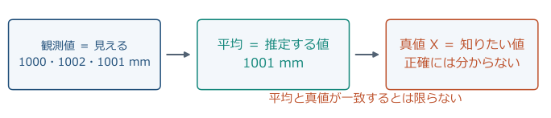
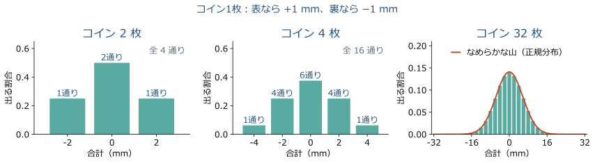
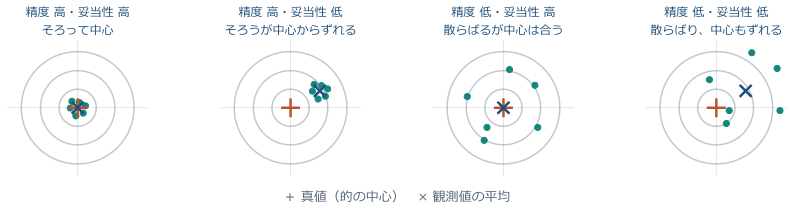
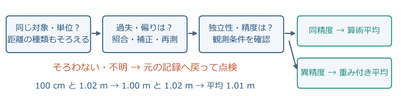
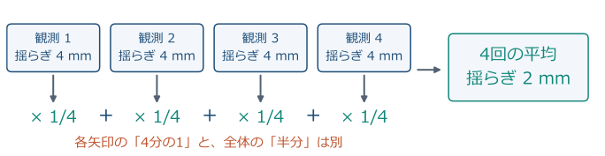
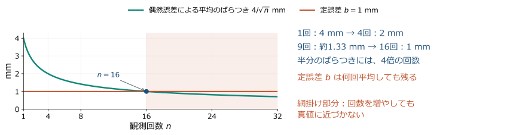
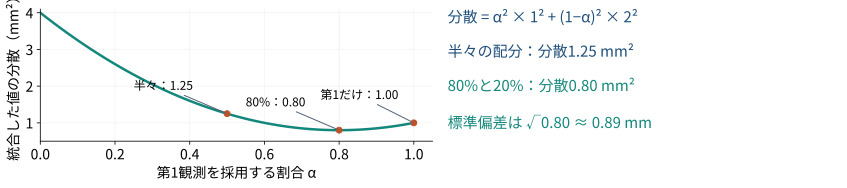

<!-- _class: lead -->

# 測量学 第2回

## 測量の基礎と誤差論

農業農村工学系の学部講義｜図解・やさしい解説版（2026-10-08）

**観測値の最確値と精度を計算し、誤差の種類と重みを説明する。**

<!-- 導入の1枚目です。圃場や水路の測量成果には、座標や距離だけでなく精度の説明も必要だと伝えます。 -->

---

## 2-0 前回の演習の解答確認

- 度分秒の復習例：$1^\circ30'00''=1.5^\circ$
- 逆変換：$0.25^\circ=15'00''$
- 桁の復習例：$12.346\ \mathrm{m}\rightarrow12.35\ \mathrm{m}$（0.01 m 単位）
- 電卓の表示桁数と、観測の精度は別に考える。

<!-- 前回の実際の出題値はここでは与えられていないため、同じ型の復習例で確認します。度分秒を十進数と混同していないか、その場で確かめます。 -->

---

## 2-0 本日の到達目標

- 過失・定誤差・偶然誤差を、原因と対処に結び付ける。
- 反復観測から最確値・残差・2種類の標準偏差を求める。
- 精度の異なる観測を、重み付き平均で統合する。
- 機器の精度表示を読み、成果の点検につなげる。

<!-- 計算できることと説明できることの両方を目標にします。最後の手計算テストでは、結果だけでなく残差表と途中式も提出します。 -->

---

## 2-0 水路の測量で必要になる判断

- 同じ区間を測っても、毎回まったく同じ値にはならない。
- 小さな高低差は、排水方向や水路勾配の判断に関わる。
- 差が「地形の違い」か「観測のばらつき」かを吟味する。
- まず距離の簡単な反復観測で、判断の基礎を学ぶ。

<!-- 実習メモではレベル測量によって水路の局所的な盛り上がりを把握しています。今日は勾配の計算へ進む前に、観測値の信頼性を数量化する準備をします。 -->

---

## 2-0 本日の流れと時間配分

| 時間 | 内容 |
| --- | --- |
| 0〜5分 | 前回の確認・到達目標 |
| 5〜60分 | 誤差・最確値・標準偏差・重み |
| 60〜85分 | 手計算テスト25分 |
| 85〜90分 | 要点確認・提出・次回予告 |

<!-- 講義中の例題と同じ型を、数値を変えて演習で解きます。演習の詳しい解説は次回冒頭に行います。 -->

---

## 2-1 真値と観測値

**観測値は見えるけれど、真値は直接見えない。**
- 同じ机を測っても、1000 mm、1002 mm、1001 mmと少し違う。
- $x_i$ は表示・記録できる値。$X$ は本当に知りたい長さ。
- 平均は $X$ の「推定」。ぴったり正しいと確定した答えではない。

<!-- 同じ机を三人で測る場面を思い浮かべてもらいます。観測値は読めても、誤差ゼロの真値は普通は分からず、真の誤差 ε_i=x_i−X も直接は計算できません。i は測った順番、n は観測回数で、この例は n=3、平均1001 mmです。 -->

---

## 2-1 誤差の3分類

**「どうずれたか」によって、直し方が変わる。**

| 分類 | 身近なイメージ | 対処 |
| --- | --- | --- |
| 過失（錯誤） | 数字の写し間違い | 元の記録を確認・再測 |
| 定誤差（系統誤差） | ずれたゼロ点で測り続ける | 原因を調べて補正 |
| 偶然誤差（不定誤差） | 読む位置が毎回少し揺れる | 反復観測と統計処理 |

<!-- 一つの観測には複数の種類の誤差が重なることがあります。平均は万能な修正ではないので、まず原因を分類して対処する順番を覚えてもらいます。 -->

---

## 2-1 過失の例と対処

**過失＝測り方・読み方・記録の「うっかり間違い」。**
- 機器の表示は30.003 mなのに、ノートへ30.030 mと写した。
- 点Aを測るはずが、点Bを測ってしまうのも過失。
- 表示・野帳・点名を照合し、原因を確認して補正または再測する。
- 離れた値も勝手に消さず、元の記録と処理の理由を残す。

<!-- 例の転記だけで27 mmの違いが生じます。他の正しい値と平均しても間違いが薄まるだけで、正しい測定には戻りません。外れた値は点検のきっかけであり、見た目だけで過失と断定しないと説明します。 -->

---

## 2-1 定誤差の例と対処

**定誤差＝同じ条件で、決まった方向や規則でずれること。**
- 例：ゼロ点が2 mmずれていると、何回測っても2 mm大きい。
- 1002、1003、1001 mmの平均は1002 mm。共通の2 mmは残る。
- 基準との比較で「+2 mm」と確認できれば、2 mm引いて補正する。
- 測量では巻尺の伸びや機器の設定を点検する。条件でずれ方も変わる。

<!-- これは1000 mmの基準を使った仮想例です。平均しただけでは共通の偏りはなくならないことを、三つの値すべてから2 mm引く操作と比べて説明します。定誤差という名称でも常に同じ数値とは限らず、温度や距離に応じた規則的な変化も含みます。 -->

---

## 2-1 偶然誤差の例と対処

**偶然誤差＝気を付けても毎回少し変わる、小さな揺らぎ。**
- 目盛りの読み位置、望遠鏡を合わせる向きなどが少しずつ変わる。
- ある回は大きめ、別の回は小さめ。次のずれの符号は読めない。
- 偏りのない独立な観測なら、平均で揺らぎの影響を小さくできる。
- 機器・三脚を点検してから繰り返し測り、ばらつきも報告する。

<!-- プラスとマイナスの揺らぎは平均すると打ち消し合いやすくなりますが、少ない回数で必ずゼロになるわけではありません。ぐらついた三脚など、取り除ける原因は先に取り除きます。反復して数値をそろえることと、真値に近づけることの違いにつなげます。 -->

---

## 2-1 この後の計算の前提

- 観測対象は変化せず、同じ距離を測っている。
- 過失を点検し、必要な定誤差の補正を済ませている。
- 偶然誤差の平均は0と考える。
- 「独立」：ある観測の誤差が、別の観測の誤差に連動しない。
- 等しい条件・ばらつきを持つ観測を「同精度」と呼ぶ。

<!-- 観測回数を増やす効果には前提があることを強調します。連続して取得した値が、必ず独立な観測になるわけではありません。 -->

---

## 2-1 ここまでの確認①

**反射鏡定数の設定が誤ったまま、同じ距離を10回測った。**

平均すればこの偏りを除けるか。誤差の分類とともに答えよう。

<!-- 答えは除けない、分類は定誤差です。設定と記録を点検し、必要な補正または再測を行うと説明します。 -->

---

## 2-2 偶然誤差と正規分布

**背景にあるのは、確率論の「中心極限定理」。**
- 1回の誤差を、読み取り・照準など多くの小さな揺らぎの足し算と考える。
- 独立な寄与が重なり、極端に大きい一つの要因が支配しないとき、
  合計の分布は、条件の下で正規分布に近づく。
- 偏りを取り除けば、誤差0付近が多い左右対称の山で近似できる。
- 過失・共通の偏り・強い連動がある場合は、無条件には使えない。

> 出典 [1] JCGM 100:2008（GUM）, G.2.1–G.2.2（本文p.71）。末尾にリンク。

<!-- 基本形の中心極限定理は、独立・同分布で有限かつ正の分散を持つ変数の和を標準化すると、項数の増加に伴い標準正規分布へ収束するという定理です。異なる小要因の和に適用するには、一つの寄与が支配しないことなど追加条件が必要で、ここでは測定への近似の根拠として紹介します。観測回数を増やすと個々の測定値そのものが正規分布に変わる、という意味ではありません。 -->

---

## 2-2 足し合わせると、なぜ山になる？

- 教材モデル：各要因が、独立に「−1」か「+1」を同じ確率で出す。
- 真ん中付近になる組合せは多く、全部が同じ符号になる組合せは少ない。
- 下図は厳密な二項確率。要因が増えると、標準化した山が正規曲線に近づく。

> 出典 [1] GUM G.2。図は説明用モデルの計算結果（実測値ではない）。

<!-- 二要因では−2が一通り、0が二通り、+2が一通りです。横軸は和をその標準偏差で割ってそろえ、要因数による単なる横幅の変化と分布形の変化を区別します。この足し算の例が直観であり、現場データで正規近似が妥当かは別途点検します。 -->

---

## 2-2／2-4 標準偏差①：散らばりを1つの数に

**標準偏差＝平均のまわりの「散らばりの大きさ」。小さいほどそろう。**
- 残差 $v_i=x_i-\bar{x}$：平均からのずれ。$\bar{x}$ は平均、$n$ は個数。
- 手順：ずれを二乗 → 足す → $n-1$ で割る → 平方根を取る。

$$
\sigma=\sqrt{\frac{\sum v_i^2}{n-1}}
\qquad
\sqrt{\frac{(-2)^2+0^2+2^2}{3-1}}=2\ \mathrm{mm}
$$

- 例は998、1000、1002 mm。平均1000 mmからのずれは−2、0、+2 mm。
- 平均を推定したため残差和は0。自由に決められるのは $n-1$ 個。
- 二乗で mm²、平方根で mmに戻る。$\sigma$ は推定値（一般には $s$）。

> 出典 [1] GUM 4.2.2–4.2.3。高校のデータ記述で使う「nで割る分散」と区別。

<!-- 二乗はプラスとマイナスの打ち消しを防ぎ、平方根は元の長さの単位へ戻す操作です。同じデータから平均を決めるとずれが小さめになるため、未知の母分散の推定ではnではなくn−1で割ります。例えば残差が三つなら二つが決まると最後は残差和ゼロから決まり、自由度は二です。標準偏差は最大のずれや絶対値の単純平均ではありません。 -->

---

## 2-2／2-4 標準偏差②：誤差の範囲と信頼区間

- **観測1個の誤差**：平均0の正規分布なら、母標準偏差 $\tau$ の
  ±1倍に約68%、±2倍に約95%が入る（$\sigma$ は $\tau$ の推定値）。
- **平均から真値を探す95%信頼区間**：独立・同精度・正規分布・偏りなしなら、

$$
\bar{x}\ \pm\ t_{0.975,n-1}\frac{\sigma}{\sqrt n}
$$

- 95%とは、測定と区間作りを何度も繰り返すと、約95%が真値を含むこと。
- $t$ は少数観測の不確かさも考慮する係数。6回なら2.571（自由度5）。
- 例：$\bar{x}=50.005$ m、$\sigma/\sqrt6=1.183$ mmなら、平均を中心に±3.04 mm。

> 出典 [2] NIST §1.3.5.2、[1] GUM G.3・表G.2。例の数値は後の例題A。

<!-- 信頼区間は、真値を挟むための幅をデータから作る方法です。観測値の95%が入る範囲と、平均から真値を推定する区間では、対象も幅も違います。一度計算した区間に真値が95%の確率で動いて入るという意味ではなく、区間を作る手続きの長期的な割合です。未補正の偏りや相関が残る場合、この式だけでは真値を含む割合を保証できません。 -->

---

## 2-2 精度と確度

- **精度**＝何度も測った値のそろい方。**確度**＝真値への近さ。
- 中心が真値、点が観測値。まとまっていても、中心を外れていれば偏りがある。

<!-- 的の中心を真値と見立て、左から順番に点の広がりと中心からの距離を比べます。中央の図は精度が高くても確度が低い例で、同じ偏りを持つ測定を繰り返した状況に相当します。右の図の平均が中心付近でも個々の測定の確度が高いとは限りません。用語は本講義の使い分けで、機器仕様の「精度」は定義を確認します。 -->

---

## 2-2 有効数字と表示桁

- 12.340 m の末尾の0は、mm の位まで示した記録。
- 0.0042 m の先頭の0は位取りで、有効数字は2桁。
- 1 mm まで読む機器でも、誤差が1 mm以内とは限らない。
- 計算機が表示する多数の桁を、そのまま成果の精度としない。

<!-- 分解能は読み取れる最小の刻みであり、標準偏差や確度とは異なります。桁数は単位と一緒に読ませ、距離の表示と精度表示を混同しないようにします。 -->

---

## 2-2 計算途中と最終結果の丸め

- 途中計算は電卓内の桁を保持し、最後に丸める。
- 距離の加減算は小数の位、乗除算は有効数字を意識する。
- 実際の成果は、要求仕様と不確かさに応じた桁で示す。
- 本日の距離は0.001 m、標準偏差は0.01 mmまで。
- 例：$2.898275\ldots\ \mathrm{mm}\rightarrow2.90\ \mathrm{mm}$（四捨五入）

<!-- 演習の標準偏差の桁は解答比較のための指定で、実際の確度を意味しません。丸めを繰り返すと検算が崩れるため、途中値を保存して計算します。 -->

---

## 2-2 旧用語：確率誤差

- 確率誤差を $r$ とすると、正規分布では $r=0.6745\sigma$。
- 誤差が $-r$ 〜 $+r$ に入る確率が50%となる幅。
- 最大誤差や、95%の範囲を意味する用語ではない。
- 旧来の資料の読解用に知り、本講義の計算は標準偏差で統一。

<!-- 古い測量の参考書で確率誤差に出会ったときの読み方を説明します。以後の演習ではこの係数を使う必要はありません。 -->

---

## 2-3 最確値：同精度なら算術平均

$\bar{x}$：同じ量を測った観測値から求める最確値

$$
\bar{x}=\frac{\sum_{i=1}^{n}x_i}{n}
$$

- $x_i$ が m なら、$\bar{x}$ も m。
- 真値そのものではなく、観測モデルに基づく推定値。

<!-- 独立・同精度で偏りのない観測を想定していることを再確認します。正規分布のモデルでは算術平均が最も尤もらしい値にもなります。 -->

---

## 2-3 平均を取る前の点検

**平均ボタンを押す前に、「同じものを比べている？」を確かめる。**
- 100 cmと1.02 mは、単位をそろえれば平均できる。
- 坂に沿う長さと真上から見た長さは別物。まず同じ種類の距離へ換算する。
- 数字が大きく離れたら記録・条件を確認する。自動で削除しない。

<!-- 同じ机の長さでも、センチメートルとメートルの数字をそのまま足してはいけません。斜距離と水平距離は単位が同じでも対象量が違い、単位換算だけではそろいません。図のどこかで条件がそろわなければ元の記録に戻り、補正や再測をしてから統合します。 -->

---

## 2-3 最小二乗法への入口

$a$ を最確値の候補、$Q(a)$ を候補からの差の平方和とする。

$$
Q(a)=\sum_{i=1}^{n}(x_i-a)^2
$$

- 正負の差を打ち消さず、大きなずれを強く評価する。
- $Q(a)$ が最小になる $a$ を探す。

<!-- 単純な差の和は正負が相殺されるので、ずれの大きさを測れません。二乗和を最小にするという共通の考え方が、後の測量の調整計算につながります。 -->

---

## 2-3 二乗和が最小になる値

$$
\frac{dQ}{da}=2na-2\sum x_i=0
\quad\Rightarrow\quad a=\frac{\sum x_i}{n}=\bar{x}
$$

$$
\frac{d^2Q}{da^2}=2n>0
$$

同精度では、**算術平均が残差平方和を最小にする。**

<!-- 二次関数の谷の底を求めていると説明すると、微分が苦手な学生にも伝わります。最小二乗法から算術平均が出てくることを確認します。 -->

---

## 2-3 残差と検算

残差 $v_i=x_i-\bar{x}$：観測値から最確値を引いた値

$$
\sum v_i=\sum x_i-n\bar{x}=0
$$

- 観測値が平均より大きければ、残差は正。
- 真の誤差 $\varepsilon_i=x_i-X$ とは異なる。
- 平均を早く丸めると、残差和が0からずれることがある。

<!-- 残差の符号は資料によって流儀が異なりますが、本講義では観測値から平均を引きます。残差和が0でも過失がない証明にはならず、計算上の検算だと伝えます。 -->

---

## 2-3 ここまでの確認②

**同精度の3観測の残差が、$-2,\ +1,\ +3$ mmとなった。**

丸め前の算術平均に対する残差として正しいか。
検算式を使って答えよう。

<!-- 残差和は2 mmなので、この条件では正しくありません。平均、引き算、単位の変換を再確認させます。 -->

---

## 2-4 最確値の標準偏差

$\sigma_{\bar{x}}$：平均という推定値のばらつき

$$
\sigma_{\bar{x}}=\frac{\sigma}{\sqrt n}
$$

- 独立・同精度の観測に適用する。
- 観測1個の $\sigma$ と、平均の $\sigma_{\bar{x}}$ を区別する。
- 例：$\sigma=4$ mm、$n=4$ なら $\sigma_{\bar{x}}=2$ mm。

<!-- 同じ実験を何度も繰り返して平均を作ると、その平均にもばらつきが生じます。平均の標準偏差はそのばらつきの推定であり、個々の値の散らばりとは別です。 -->

---

## 2-4 平均への誤差伝播：4回平均で考える

**平均を取ると、一つの観測のずれは「4分の1」だけ結果に伝わる。**
- 4回の平均では、一つだけ4 mm大きくなると、平均は1 mm大きくなる。
- ただし4回とも揺れるので、最終的な標準偏差は単純に4分の1にはならない。
- 独立な揺らぎは「標準偏差の二乗＝分散」で足し合わせる。

> 出典 [1] GUM 5.1.2（分散の伝播）。次のスライドで数値計算。

<!-- 誤差伝播とは入力の揺らぎが計算結果へどう伝わるかという意味です。四つの入力をそれぞれ四分の一にして足す操作なので、一つの入力の影響は四分の一になります。しかし四つともランダムに揺れるため、全体の揺らぎは二乗して足してから平方根に戻します。 -->

---

## 2-4 平均への誤差伝播：二乗して足す理由

- 分散＝ずれの二乗の平均。独立で平均0のずれ同士は、積の平均が0。
- ずれを $1/n$ 倍すると、その二乗は $1/n^2$ 倍。これを $n$ 個足す。

$$
\operatorname{Var}(\bar{x})=n\left(\frac1n\right)^2\tau^2=\frac{\tau^2}{n}
\quad\Rightarrow\quad \sigma_{\bar{x}}=\frac{\sigma}{\sqrt n}
$$

- $\operatorname{Var}$ は分散。母標準偏差 $\tau$ を、データの $\sigma$ で推定する。
- 各観測の $\sigma=4$ mm、4回平均なら：分散 $4\times(4/4)^2=4$ mm²。
- 平方根を取ると2 mm。**4回平均で、ばらつきの大きさは半分。**

> 出典 [1] GUM 4.2.3・5.1.2。独立・同精度、有限の分散を仮定。

<!-- 二つのずれの和を二乗すると、それぞれの二乗に加えて積の二倍が現れます。独立で平均ゼロなら積の平均がゼロになるため、分散を足せます。独立・同精度ならこの分散の式に正規分布の仮定は不要で、中心極限定理とは別の性質です。相関がある場合は積の平均に対応する共分散も必要になります。 -->

---

## 2-4 観測回数を増やす効果と限界

- 前の式より、独立・同精度なら分散は $1/n$、標準偏差は $1/\sqrt n$。
- 共通の偏りを $b$、偶然の揺らぎを $\varepsilon_i$ とすると、
  $x_i=X+b+\varepsilon_i$。平均でも $\bar{x}=X+b+\bar{\varepsilon}$ と $b$ は残る。
- 同じ向きに連動する観測では、回数ほど情報は増えない。

> 出典 [1] GUM 4.2.3・5.2.2。図は1観測の標準偏差4 mmの理論例。

<!-- 独立なら一回4 mm、四回2 mm、九回約1.33 mm、十六回1 mmとなり、半分にするには四倍の回数が必要です。図の相関例は全ペアの相関係数が0.5という説明用モデルで、平均の分散はτ²{ρ+(1−ρ)/n}となります。固定した偏りbは平均の分散に現れなくても真値からのずれとして残るので、基準との照合が要ります。 -->

---

## 2-5 例題A：距離の6回観測

同じ距離を独立・同精度で6回観測し、必要な補正を済ませた。

| 回 $i$ | 1 | 2 | 3 | 4 | 5 | 6 |
| --- | ---: | ---: | ---: | ---: | ---: | ---: |
| $x_i$（m） | 50.001 | 50.003 | 50.004 | 50.006 | 50.007 | 50.009 |

求める量：$\bar{x}$、$v_i$、$\sigma$、$\sigma_{\bar{x}}$

<!-- 数値は手計算用に設定した仮想データです。まず単位と回数を確認してから平均を計算します。 -->

---

## 2-5 例題A：最確値

$$
\sum x_i=300.030\ \mathrm{m},\qquad
\bar{x}=\frac{300.030}{6}=50.005\ \mathrm{m}
$$

- 50 m を共通部分として、端数1・3・4・6・7・9 mmを平均してもよい。
- 端数の合計30 mm、平均5 mm。
- 残差は $(x_i-\bar{x})\times1000$ で mm に直す。

<!-- 大きな共通部分を外して端数だけで計算すると、桁の入力間違いを減らせます。平均の最後に共通の50メートルを戻します。 -->

---

## 2-5 例題A：残差表の前半

| $i$ | $x_i$（m） | $v_i$（mm） | $v_i^2$（mm²） |
| --- | ---: | ---: | ---: |
| 1 | 50.001 | −4 | 16 |
| 2 | 50.003 | −2 | 4 |
| 3 | 50.004 | −1 | 1 |

例：$(50.001-50.005)\times1000=-4$ mm。
二乗は $(-4)^2=16$ mm²。

<!-- 二乗ではマイナスの符号も括弧の中に入れます。表の残差列だけをミリメートルに変えていることを再確認します。 -->

---

## 2-5 例題A：残差表の後半と合計

| $i$ | $x_i$（m） | $v_i$（mm） | $v_i^2$（mm²） |
| --- | ---: | ---: | ---: |
| 4 | 50.006 | +1 | 1 |
| 5 | 50.007 | +2 | 4 |
| 6 | 50.009 | +4 | 16 |
| 全6回の合計 | 300.030 | 0 | 42 |

$\sum v_i=-4-2-1+1+2+4=0$ mm。

<!-- この合計行は前のスライドの3回分を含む全6回です。平方和42を、次の標準偏差計算に使います。 -->

---

## 2-5 例題A：1観測の標準偏差

$$
\sigma=\sqrt{\frac{42}{6-1}}
=\sqrt{8.4}=2.898275\ldots\ \mathrm{mm}
$$

$$
\boxed{\sigma=2.90\ \mathrm{mm}}
$$

分母は自由度5。結果の単位は mm。

<!-- 六回の観測でも分母は六ではなく五です。電卓内には丸め前の値を残したまま、表示する答えだけを丸めます。 -->

---

## 2-5 ここまでの確認③

**例題Aの平方和42 mm²を6で割って平方根を取った。**

1観測の標準偏差の推定として、どこを直すべきか。
理由も一言添えよう。

<!-- 平均を同じ六つのデータから推定したため、分母を自由度五に直すのが答えです。残差和がゼロという制約と結び付けて答えさせます。 -->

---

## 2-5 例題A：最確値の標準偏差

$$
\sigma_{\bar{x}}=\frac{\sqrt{8.4}}{\sqrt6}
=\sqrt{1.4}=1.183215\ldots\ \mathrm{mm}
$$

最確値 $\bar{x}=50.005$ m、$\sigma_{\bar{x}}=1.18$ mm。
1観測の標準偏差 $\sigma=2.90$ mm も区別して記録する。

<!-- 平均の標準偏差の計算に、丸めた2.90を代入しないようにします。最確値とその標準偏差を併記すれば、距離の推定結果とばらつきの説明がそろいます。 -->

---

## 2-6 重みの一般則

$w_i$：観測値 $x_i$ に与える相対的な重み
$\sigma_i$：その観測値の標準偏差

$$
w_i\propto\frac1{\sigma_i^2}
$$

標準偏差が半分なら分散は $1/4$、重みは4倍。
以下の計算例では、重みを**無次元の比**として扱う。

<!-- 重みは標準偏差そのものの逆数ではなく、分散の逆数に比例します。重みが大きい値ほど、統合した最確値への寄与が大きくなります。 -->

---

## 2-6 分散を小さくする配分

- 独立で偏りのない2観測。第1の標準偏差1 mm、第2は2 mmとする。
- 「採用する割合」を $\alpha$ と $1-\alpha$ に分ける（合計1）。
  $y=\alpha x_1+(1-\alpha)x_2$：$y$ は組み合わせた値。半々より良い配分は？
- 平均のときと同じく、**割合を二乗して分散に掛け、足す。**

> 出典 [3] NIST §4.1.4.3・§4.4.5.2。数値例と図は本教材の計算。

<!-- 二つとも同じ真値を狙うなら、割合の合計を一にすることで組合せ後も平均的には同じ真値を狙います。ここでは標準偏差の比は事前に分かっていると仮定します。精密な第1観測だけを使うよりも、第2観測を二割加えた方が分散は小さくなることをグラフで確かめます。 -->

---

## 2-6 分散の逆数が重みになる理由

**二次関数の「谷の底」を探せば、微分を使わず理由が分かる。**

$$
\operatorname{Var}(y)=\alpha^2+4(1-\alpha)^2=5(\alpha-0.8)^2+0.8\quad[\mathrm{mm}^2]
$$

- 二乗は0以上。$\alpha=0.8$ で0になるので、80%と20%が最適。
- 一般の標準偏差でも平方完成すると、最適な割合は次の比になる。

$$
\alpha:(1-\alpha)=\sigma_2^2:\sigma_1^2
=\frac1{\sigma_1^2}:\frac1{\sigma_2^2}=w_1:w_2
$$

- つまり、標準偏差が半分なら分散は1/4、重みは4倍。
- 独立・偏りなし・正しい分散比が前提。正規分布の仮定は不要。

> 出典 [3] NIST §4.1.4.3・§4.4.5.2。平方完成は本教材で展開。

<!-- まず数字の例ではα²+4(1−α)²=5(α−0.8)²+0.8となり、二乗がゼロになるα=0.8が谷の底です。一般にはVar(y)=(σ₁²+σ₂²){α−σ₂²/(σ₁²+σ₂²)}²+σ₁²σ₂²/(σ₁²+σ₂²)と平方完成できるため、谷の底はα=σ₂²/(σ₁²+σ₂²)となり、α:(1−α)=1/σ₁²:1/σ₂²が導けます。ここで最小なのは、係数の和が一になる線形な組合せの中での分散であり、相関や偏りがあるデータへ無条件には適用できません。 -->

---

## 2-6 同精度の独立観測を平均する場合

$n_i$：第 $i$ 組の観測回数、$\tau$：元の1観測の共通標準偏差

$$
\sigma_i^2=\frac{\tau^2}{n_i}
\quad\Rightarrow\quad w_i\propto n_i
$$

- 1回平均と4回平均の重みは $1:4$。
- 元の観測が同精度・独立である場合に限る。

<!-- 組ごとに観測回数が異なると、群平均の精度が変わります。群平均に与える重みと、元の各観測の精度を分けて説明します。 -->

---

## 2-6 水準測量で路線長を使う場合

$S_i$：路線長、$k$：単位長さ当たりの分散を表す共通係数

$$
\sigma_i^2=kS_i\quad\Rightarrow\quad w_i\propto\frac1{S_i}
$$

- 同じ2点間の比高を、同等の観測条件の別路線で求める例。
- 路線長1 kmと4 kmなら、重みは $4:1$。
- 分散が路線長に比例する条件を確認してから使う。

<!-- 長さに反比例という規則だけを無条件に覚えないようにします。測量条件や誤差の蓄積の仕方が異なる場合は、別の分散モデルが必要です。 -->

---

## 2-6 重み付き平均

$$
\bar{x}_w=\frac{\sum_{i=1}^{n}w_i x_i}{\sum_{i=1}^{n}w_i}
$$

- $\bar{x}_w$：精度の異なる観測を統合した最確値。
- $x_i$ が m、$w_i$ が無次元なら、結果は m。
- すべての重みが等しければ、算術平均に戻る。

<!-- 重みが大きい観測へ平均が近づくことを、計算前に予想させます。すべての重みが正なら、結果は観測値の最小値と最大値の間に入ります。 -->

---

## 2-6 重み付き平均の残差と検算

この場合の残差は $v_i=x_i-\bar{x}_w$。

$$
\sum w_i v_i=\sum w_i x_i-\bar{x}_w\sum w_i=0
$$

- 検算は **加重残差和** を使う。
- 通常の残差和 $\sum v_i$ は、0とは限らない。
- $\sum w_i(x_i-a)^2$ を最小にする値も $\bar{x}_w$。

<!-- 算術平均の残差和ゼロを、そのまま重み付き平均へ持ち込む間違いを防ぎます。残差の符号の定義はここでも観測値から最確値を引く向きです。 -->

---

## 2-6 単位重みの標準偏差

$$
\sigma_0=\sqrt{\frac{\sum w_i v_i^2}{n-1}}
$$

- $\sigma_0$：重み1に対応する標準偏差の推定値。
- 相対重みを決め、共通の分散尺度を残差から推定する。
- $n$ は統合する独立な値の個数、未知数は最確値1個。
- 無次元の重みなら、$v_i$ と $\sigma_0$ の単位は同じ。

<!-- 群平均を二つ入力するならエヌは二で、元の観測回数の合計ではありません。二つの群平均だけからの推定は自由度一なので、不安定さが大きい点にも触れます。 -->

---

## 2-6 重み付き平均の標準偏差

$$
\sigma_{\bar{x}_w}=\frac{\sigma_0}{\sqrt{\sum w_i}}
$$

- 各観測の分散を共通尺度 $\tau^2/w_i$ として考える。
- 正規化した係数 $w_i/\sum w_i$ で誤差を伝播させると、

$$
\operatorname{Var}(\bar{x}_w)=\frac{\tau^2}{\sum w_i}
$$

- 未知の尺度 $\tau$ は、残差から求めた $\sigma_0$ で推定する。

<!-- 係数の二乗と各観測の分散を掛けて足すと、重みの和が分母に残ります。絶対的な標準偏差が既知の場合と、残差から分散尺度を推定する場合は区別します。 -->

---

## 2-6 重みの尺度と注意点

- 比が同じなら、重み $1:4$ と $2:8$ の最確値は同じ。
- 重みを一律 $c$ 倍すると、$\sigma_0$ は $\sqrt c$ 倍。
- $\sigma_{\bar{x}_w}$ は分母も $\sqrt c$ 倍なので変わらない。
- 絶対分散が既知で $w_i=1/\sigma_i^2$ と置く場合は、
  平均の標準偏差は $1/\sqrt{\sum w_i}$（重みに逆分散の単位）。

<!-- 単位重みの標準偏差は、重み一という尺度の選び方に依存します。今回の演習は無次元の相対重みを使い、残差からシグマゼロを求める設定に統一します。 -->

---

## 2-6 ここまでの確認④

**第1組の標準偏差が、第2組の2倍である。**

適切な重みの比 $w_1:w_2$ はいくつか。
最確値は、どちらの観測値に近づくか。

<!-- 答えは一対四で、標準偏差の小さい第2組へ近づきます。逆数だけで一対二にしていないかを確認します。 -->

---

## 2-7 例題B：回数の異なる2組

同じ距離の群平均。元の各観測は同精度、群内・群間とも独立。

| 組 | 回数 $n_i$ | 群平均 $x_i$（m） | 重み $w_i$ |
| --- | ---: | ---: | ---: |
| 1 | 4 | 40.002 | 4 |
| 2 | 1 | 40.012 | 1 |

過失・定誤差は処理済み。絶対分散は未知。
2個の群平均の残差から、標準偏差も推定する。

<!-- 観測回数の違いによって群平均の精度が異なる例です。第1組の標準偏差は第2組の半分なので、重みを四対一とします。 -->

---

## 2-7 例題B：重み付き平均

$$
\bar{x}_w=\frac{4\times40.002+1\times40.012}{4+1}
=\frac{200.020}{5}=40.004\ \mathrm{m}
$$

| 組 | $w_i$ | $w_i x_i$（m） |
| --- | ---: | ---: |
| 1 | 4 | 160.008 |
| 2 | 1 | 40.012 |

<!-- 平均は精度の高い40.002メートルの側に近づきます。単純平均の40.007メートルとの違いを口頭で比較します。 -->

---

## 2-7 例題B：残差と加重平方和

| 組 | $w_i$ | $v_i$（mm） | $w_i v_i^2$（mm²） |
| --- | ---: | ---: | ---: |
| 1 | 4 | −2 | 16 |
| 2 | 1 | +8 | 64 |
| 合計 | 5 | — | 80 |

$\sum w_i v_i=4\times(-2)+1\times8=0$ mm。
通常の残差和は $-2+8=6$ mmでもよい。

<!-- 加重残差平方和では、重みは二乗しません。四掛けるマイナス二の二乗が十六になることを確かめます。 -->

---

## 2-7 例題B：2種類の標準偏差

$$
\sigma_0=\sqrt{\frac{80}{2-1}}
=8.944271\ldots\ \mathrm{mm}\rightarrow8.94\ \mathrm{mm}
$$

$$
\sigma_{\bar{x}_w}=\frac{\sqrt{80}}{\sqrt5}
=4.00\ \mathrm{mm}
$$

最確値40.004 m、重み付き平均の標準偏差4.00 mm。

<!-- 自由度は二つの群平均から一つの最確値を決めたので一です。分母を元の五観測から一を引いた四にしないようにします。 -->

---

## 2-7 例題Bの結果をどう読むか

- 重み $4:1$ は、事前に与えた相対精度。
- $\sigma_0$ は、2個の群平均の食い違いから求めた尺度。
- 自由度1の推定なので、標準偏差の推定自体も不確か。
- 群内の記録も保存し、追加観測や独立した点検を行う。

<!-- 群平均だけでは元の観測の群内平方和を復元できません。計算例が成立することと、実務の精度管理に十分な情報があることを分けて考えます。 -->

---

## 2-8 TS・GNSS の標準偏差表示

- TS：反復した距離・角のばらつきか、座標の推定精度かを確認。
- GNSS：観測モデルから推定した位置の不確かさの場合がある。
- 対象量、単位、1標準偏差か別の指標かを説明書で読む。
- 水平・高さ・各座標成分の値を区別する。
- 表示が小さくても、共通の偏りを含む全誤差の保証にはならない。

<!-- 同じ精度という見出しでも、表示の定義は機器や設定によって異なります。位置全体の指標へ1次元の68パーセント則をそのまま当てはめないようにします。 -->

---

## 2-8 測距精度の ppm 表示

$a$：定数項、$b$：距離比例項の係数、$1\ \mathrm{ppm}=10^{-6}$

$$
\pm(a\ \mathrm{mm}+b\ \mathrm{ppm})
$$

500 mで $\pm(2\ \mathrm{mm}+2\ \mathrm{ppm})$ なら、
$2\times10^{-6}\times500\ \mathrm{m}=1\ \mathrm{mm}$。
したがって **$\pm(2+1)=\pm3$ mm**。適用条件と統計的定義も確認。

<!-- これは実機を指定しない仮想的な仕様例です。プラスマイナスという表記だけで最大誤差や95パーセント範囲と決め付けないようにします。 -->

---

## 2-8 実習で同一点を3回測る理由

- 実習では同一地点を3回計測し、平均を取った。
- 繰り返すことで、ばらつきや異常な値の存在に気付きやすい。
- 独立・同精度なら、平均の標準偏差は $\sigma/\sqrt3$。
- 連続する GNSS 観測の相関や共通の偏りは別途点検する。
- 平均の前に、元データと観測条件を確認する。

<!-- 事例は実習指導メモの同一地点三回計測に基づきます。三回なら必ず十分という規則ではなく、異常の点検とばらつきの低減を学ぶ例として扱います。 -->

---

## 2-8 RTK の固定解と精度表示

- RTK：基準局などの情報を使う、搬送波位相による測位。
- 固定解：搬送波の整数値バイアスを整数として決定した解。
- 固定解でも、誤った整数決定やマルチパスの影響はあり得る。
- 精度表示に加え、再初期化後の比較や既知点での点検を行う。
- 固定解という表示だけで、確度を保証したとはいえない。

<!-- 国土地理院の解説でも、初期化時のノイズやマルチパスによる整数値バイアスの誤決定を説明しています。固定解の仕組みは第9回に詳しく学び、今日は表示の読み方にとどめます。参考：https://www.gsi.go.jp/common/000258817.pdf -->

---

## 2-9 精度管理と技術者倫理

- 観測の較差や閉合差が許容値を超えたら、原因を点検し再測する。
- 合格するように観測値を書き換えない。
- 補正値・計算過程・再測の理由と元の記録を残す。
- 成果を独立に点検し、基準・単位・精度を確認する。

<!-- 計算上の最確値を求めることと、記録の改ざんは全く異なります。正しい補正や調整も、根拠と元の観測が追える形で行うことを強調します。 -->

---

## 2-9 手計算の共通手順

1. 条件を読む：同じ量・独立性・同精度か、重みが要るか。
2. 最確値を求める：算術平均または重み付き平均。
3. 残差を mm で表にし、残差和または加重残差和を検算。
4. 平方和から標準偏差、さらに平均の標準偏差を求める。
5. 単位と指定桁を確認して、最後に丸める。

<!-- 公式を個別に暗記するより、表を完成させる順序を覚える方が誤りを防げます。演習に入る前に、どの段階で重みを使うかを頭の中で整理させます。 -->

---

## 2-9 ここまでの確認⑤

**RTK が固定解で、表示する標準偏差も小さかった。**

この情報だけで確度が十分と判断してよいか。
必要な点検を一つ挙げよう。

<!-- 答えは判断できないで、既知点との比較や再初期化後の再観測などが必要です。平均と精度の数値を求めるだけでなく、独立した点検を選ぶ力を確認します。 -->

---

## 2-10 手計算テスト：短答

25分・10点満点。関数電卓使用可。短答は各0.5点。

1. TS の距離 30.003 m を 30.030 m と転記した。誤差の分類名を書く。
2. 巻尺の尺定数による偏りがある。誤差の分類名と対処を一つ書く。
3. 独立・同精度の観測回数を4倍にすると、平均の標準偏差は何倍か。
4. 観測の較差が許容値を超えた。観測値を保存したうえで行う対応を書く。

<!-- 演習開始時刻を告げ、短答には三分程度を使わせます。解答は示さず、配布用紙と同じ問題文を読み上げます。 -->

---

## 2-10 問1：反復観測（4点）

同一距離を独立・同精度で6回観測した。過失と定誤差は処理済みとする。

観測値（m）：30.003、30.004、30.005、30.007、30.008、30.009。

最確値 $\bar{x}$、各残差 $v_i$、$\sum v_i$、$\sum v_i^2$、
1観測の標準偏差 $\sigma$、最確値の標準偏差 $\sigma_{\bar{x}}$ を求める。

<!-- 配布用紙の残差表に記入させ、十一分程度を目安にします。質問には単位や記号を説明し、数値の答えはまだ伝えません。 -->

---

## 2-10 問2：精度の異なる2組（4点）

圃場の同一辺を測った2組の群平均を統合する（元の各観測は同精度・独立、過失と定誤差は処理済み）。

| 組 $i$ | 観測回数 $n_i$ | 群平均 $x_i$（m） |
| --- | ---: | ---: |
| 1 | 1 | 80.000 |
| 2 | 4 | 80.015 |

- 求めるもの：$w_2$（$w_1=1$）とその根拠、$\bar{x}_w$、$v_i$、$\sum w_i v_i$、$\sum w_i v_i^2$、$\sigma_0$、$\sigma_{\bar{x}_w}$
- 絶対的な標準偏差は未知。2個の群平均の残差から推定し、式の $n$ は群数2とする。

<!-- 配布用紙の問二と同じ条件です。九分程度を目安とし、残り時間に応じて計算途中でも先の設問へ進むよう案内します。 -->

---

## 2-10 計算手順と記入規則

- 平均 → 残差 → 平方和 → 標準偏差の順で計算する。
- 問1は残差和、問2は加重残差和を検算する。
- 距離は m で小数第3位、残差は mm、二乗は mm²。
- 標準偏差は途中で丸めず、最後に小数第3位を四捨五入。
- 0.01 mmまで示し、計算表と途中式を残す。

<!-- このスライドは計算中に必要に応じて表示します。残り二分になったら検算と単位の確認へ移るよう声を掛けます。 -->

---

## 2-10 提出方法

- 提出用番号は配布紙にのみ記入する。
- 計算表・途中式を含む2ページを、授業終了時に提出する。
- 解けなかった箇所も、考えた式や途中計算を残す。
- 公開ファイルには個人を特定する情報を記入しない。
- 解説は次回冒頭に行う。

<!-- 演習二十五分の終了を告げ、計算途中も採点対象になることを伝えます。回収前に二ページがそろっているかを確認させます。 -->

---

## 2-11 本日の要点

- 誤差の分類に応じて、点検・補正・統計処理を使い分ける。
- 同精度：$\bar{x}=\sum x_i/n$、残差和は0。
- 1観測：$\sigma=\sqrt{\sum v_i^2/(n-1)}$、平均：$\sigma/\sqrt n$。
- 異精度：$w_i\propto1/\sigma_i^2$、$\bar{x}_w=\sum w_i x_i/\sum w_i$。
- 精度と確度を区別し、平均した成果も点検する。

<!-- 定義と計算手順を一度結び直します。平均がよく定まることと真値に近いことは、別に確認する必要があります。 -->

---

## 2-11 試験で問われる型

| 型 | 着眼点 |
| --- | --- |
| 誤差の分類 | 原因と対処を対応させる |
| 最確値と精度 | $n-1$ と $\sqrt n$、残差の検算 |
| 最確値と重みの関係 | 分散に反比例、同じ重みなら算術平均 |
| 回数・路線長と重み | 適用条件を確認し、比を作る |

<!-- 回数に比例と路線長に反比例を、条件なしの暗記にしないことが重要です。問題文から分散の関係を読み、重みに変換する習慣を付けます。 -->

---

## 2-11 次回：第3回 距離測量と座標系

- 冒頭5分：本日の演習の解答確認。
- 巻尺の尺定数・温度・傾斜の補正。
- 斜距離 → 水平距離 → 基準面上の距離 → 平面距離。
- 距離の誤差伝播、光波測距、平面直角座標系。
- 関数電卓を持参し、本日の残差表を復習する。

<!-- 次回は今日分類した定誤差を、具体的な式で補正します。誤差伝播は第3回の距離計算と第12回の面積計算で再び扱います。 -->

---

## 付録 出典①：正規近似・標準偏差・誤差伝播

**[1] JCGM 100:2008（GUM 1995 with minor corrections）**
Evaluation of measurement data — Guide to the expression of uncertainty in measurement

- 4.2.2–4.2.3：反復観測の分散と、平均の分散（本文p.10）。
- 5.1.2・5.2.2：分散の伝播、相関がある場合（本文pp.18–21）。
- G.2.1–G.2.2：中心極限定理による正規近似（本文p.71）。
- G.3、表G.2：t分布と少数観測の係数（本文pp.72–73、78）。

[原文PDF（BIPM公式）](https://www.bipm.org/documents/20126/2071204/JCGM_100_2008_E.pdf)

<!-- 参照日は2026年10月8日で、ページ番号はPDF内に印刷された本文の番号です。正規近似の根拠はG.2にあり、独立性と各成分の寄与の大きさなどの条件も記載されています。授業では資料の図や文章を転載せず、独自の例と図で説明しました。 -->

---

## 付録 出典②：信頼区間・逆分散の重み

**NIST/SEMATECH e-Handbook of Statistical Methods**

- **[2] §1.3.5.2 Confidence Limits for the Mean**
  95%信頼区間の意味と、t分布を使う平均の区間推定。
  [NIST公式：平均の信頼区間](https://www.itl.nist.gov/div898/handbook/eda/section3/eda352.htm)
- **[3] §4.1.4.3 Weighted Least Squares Regression**
  逆分散で重み付けする根拠と、重みが正しく分かっているという前提。
  [NIST公式：重み付き最小二乗](https://www.itl.nist.gov/div898/handbook/pmd/section1/pmd143.htm)
- **[3] §4.4.5.2 Accounting for Non-Constant Variation Across the Data**
  [NIST公式：分散と重みの関係](https://www.itl.nist.gov/div898/handbook/pmd/section4/pmd452.htm)

<!-- 参照日は2026年10月8日です。NISTの説明に加え、この教材では独立な二観測の線形結合に絞って平方完成で最適配分を導出しています。付録二枚は出典確認用で、講義本編の時間配分には含めません。 -->
