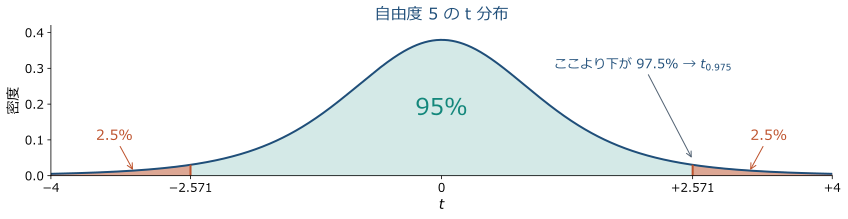
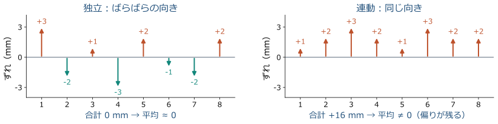
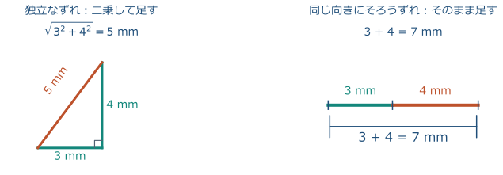

<!-- _class: lead -->

# 測量学 第2回

## 測量の基礎と誤差論

農業農村工学系の学部講義｜図解・やさしい解説版（2026-10-08）

**観測値の最確値と精度を計算し、誤差の種類と重みを説明する。**

<!-- 導入の1枚目です。圃場や水路の測量成果には、座標や距離だけでなく精度の説明も必要だと伝えます。 -->

---

## 2-0 前回の演習の解答確認

- 度分秒の復習例：$1^\circ30'00''=1.5^\circ$
- 逆変換：$0.25^\circ=15'00''$
- 桁の復習例：$12.346\ \mathrm{m}\rightarrow12.35\ \mathrm{m}$（0.01 m 単位）
- 電卓の表示桁数と、観測の精度は別に考える。

<!-- 前回の実際の出題値はここでは与えられていないため、同じ型の復習例で確認します。度分秒を十進数と混同していないか、その場で確かめます。 -->

---

## 2-0 本日の到達目標

- 過失・定誤差・偶然誤差を、原因と対処に結び付ける。
- 反復観測から最確値・残差・2種類の標準偏差を求める。
- 精度の異なる観測を、重み付き平均で統合する。
- 機器の精度表示を読み、成果の点検につなげる。

<!-- 計算できることと説明できることの両方を目標にします。最後の手計算テストでは、結果だけでなく残差表と途中式も提出します。 -->

---

## 2-0 水路の測量で必要になる判断

- 同じ区間を測っても、毎回まったく同じ値にはならない。
- 小さな高低差は、排水方向や水路勾配の判断に関わる。
- 差が「地形の違い」か「観測のばらつき」かを吟味する。
- まず距離の簡単な反復観測で、判断の基礎を学ぶ。

<!-- 実習メモではレベル測量によって水路の局所的な盛り上がりを把握しています。今日は勾配の計算へ進む前に、観測値の信頼性を数量化する準備をします。 -->

---

## 2-0 本日の流れと時間配分

| 時間 | 内容 |
| --- | --- |
| 0〜5分 | 前回の確認・到達目標 |
| 5〜60分 | 誤差・最確値・標準偏差・重み |
| 60〜85分 | 手計算テスト25分 |
| 85〜90分 | 要点確認・提出・次回予告 |

<!-- 講義中の例題と同じ型を、数値を変えて演習で解きます。演習の詳しい解説は次回冒頭に行います。 -->

---

## 2-1 真値と観測値

**観測値は見えるけれど、真値は直接見えない。**
- 同じ机を測っても、1000 mm、1002 mm、1001 mmと少し違う。
- $x_i$ は表示・記録できる値。$X$ は本当に知りたい長さ。
- 平均は $X$ の「推定」。ぴったり正しいと確定した答えではない。

<!-- 同じ机を三人で測る場面を思い浮かべてもらいます。観測値は読めても、誤差ゼロの真値は普通は分からず、真の誤差 ε_i=x_i−X も直接は計算できません。i は測った順番、n は観測回数で、この例は n=3、平均1001 mmです。 -->

---

## 2-1 誤差の3分類

**「どうずれたか」によって、直し方が変わる。**

| 分類 | 身近なイメージ | 対処 |
| --- | --- | --- |
| 過失（錯誤） | 数字の写し間違い | 元の記録を確認・再測 |
| 定誤差（系統誤差） | ずれたゼロ点で測り続ける | 原因を調べて補正 |
| 偶然誤差（不定誤差） | 読む位置が毎回少し揺れる | 反復観測と統計処理 |

<!-- 一つの観測には複数の種類の誤差が重なることがあります。平均は万能な修正ではないので、まず原因を分類して対処する順番を覚えてもらいます。 -->

---

## 2-1 過失の例と対処

**過失＝測り方・読み方・記録の「うっかり間違い」。**
- 機器の表示は30.003 mなのに、ノートへ30.030 mと写した。
- 点Aを測るはずが、点Bを測ってしまうのも過失。
- 表示・野帳・点名を照合し、原因を確認して補正または再測する。
- 離れた値も勝手に消さず、元の記録と処理の理由を残す。

<!-- 例の転記だけで27 mmの違いが生じます。他の正しい値と平均しても間違いが薄まるだけで、正しい測定には戻りません。外れた値は点検のきっかけであり、見た目だけで過失と断定しないと説明します。 -->

---

## 2-1 定誤差の例と対処

**定誤差＝同じ条件で、決まった方向や規則でずれること。**
- 例：ゼロ点が2 mmずれていると、何回測っても2 mm大きい。
- 1002、1003、1001 mmの平均は1002 mm。共通の2 mmは残る。
- 基準との比較で「+2 mm」と確認できれば、2 mm引いて補正する。
- 測量では巻尺の伸びや機器の設定を点検する。条件でずれ方も変わる。

<!-- これは1000 mmの基準を使った仮想例です。平均しただけでは共通の偏りはなくならないことを、三つの値すべてから2 mm引く操作と比べて説明します。定誤差という名称でも常に同じ数値とは限らず、温度や距離に応じた規則的な変化も含みます。 -->

---

## 2-1 偶然誤差の例と対処

**偶然誤差＝気を付けても毎回少し変わる、小さな揺らぎ。**
- 目盛りの読み位置、望遠鏡を合わせる向きなどが少しずつ変わる。
- ある回は大きめ、別の回は小さめ。次のずれの符号は読めない。
- 偏りのない独立な観測なら、平均で揺らぎの影響を小さくできる。
- 機器・三脚を点検してから繰り返し測り、ばらつきも報告する。

<!-- プラスとマイナスの揺らぎは平均すると打ち消し合いやすくなりますが、少ない回数で必ずゼロになるわけではありません。ぐらついた三脚など、取り除ける原因は先に取り除きます。反復して数値をそろえることと、真値に近づけることの違いにつなげます。 -->

---

## 2-1 この後の計算の前提

- 観測対象は変化せず、同じ距離を測っている。
- 過失を点検し、必要な定誤差の補正を済ませている。
- 偶然誤差の平均は0と考える。
- 「独立」：ある観測の誤差が、別の観測の誤差に連動しない。
- 等しい条件・ばらつきを持つ観測を「同精度」と呼ぶ。

<!-- 観測回数を増やす効果には前提があることを強調します。連続して取得した値が、必ず独立な観測になるわけではありません。 -->

---

## 2-1 ここまでの確認①

**反射鏡定数の設定が誤ったまま、同じ距離を10回測った。**

平均すればこの偏りを除けるか。誤差の分類とともに答えよう。

<!-- 答えは除けない、分類は定誤差です。設定と記録を点検し、必要な補正または再測を行うと説明します。 -->

---

## 2-2 偶然誤差と正規分布①：小さなずれの合計

**巻尺で1本の距離を1回読むとき、小さなずれが同時に何個も起きる。**

- 目盛を読む目のぶれ：±0.3 mm 程度
- 巻尺の張り方のむら：±0.5 mm 程度
- 温度のむらによる巻尺の伸び縮み：±0.2 mm 程度
- 目標への合わせ方のずれ：±0.4 mm 程度

**1回の観測の誤差 ＝ これら小さなずれの「合計」。**

- 各ずれは、互いに無関係（独立）に、プラスにもマイナスにもなる。
- 例：4つのずれが +0.3、−0.5、+0.2、+0.4 mm なら、合計は +0.4 mm。

<!-- 1回の距離読みでも、読み取り・張り方・温度・目標への合わせ方といった小さなずれが同時に重なることを、具体例で示します。数値は説明用の「程度」の例で、実測値ではありません。「独立」は、あるずれの大きさや向きが、ほかのずれに影響しないことだと一言添えます。例の合計は 0.3−0.5+0.2+0.4＝+0.4 mm です。4つのずれの大きさをすべて足した 1.4 mm よりずっと小さくなっており、この「打ち消し合い」を次のスライドで山の形につなげます。 -->

---

## 2-2 偶然誤差と正規分布②：山の形になる条件

**ずれの＋と−が混ざり、合計では打ち消し合う。誤差0付近が最も多い。**

- 4つのずれが全部同じ向きの最大値なら合計1.4 mmだが、それはまれ。
- 結果は、真ん中が高く両端が低い左右対称の山（正規分布）になる。
- この山の形で近似してよい条件は、次の3つ。
  - ① ずれの原因がたくさんあり、互いに無関係（独立）。
  - ② どれか1つだけが飛び抜けて大きくない。
  - ③ 偏り（定誤差）は、前もって取り除いてある。
- この性質を、確率論では中心極限定理と呼ぶ。

> 出典 [1] JCGM 100:2008（GUM）, G.2.1–G.2.2（本文p.71）。末尾にリンク。

<!-- 正規分布は、平均を中心に左右対称の釣り鐘形になる分布のことだと説明します。3つの条件のうち、①は「独立」、②は「どの寄与も全体を支配しない」、③は「定誤差は先に補正する」に対応します。③が必要なのは、偏りが残ると山の中心が0からずれるためです。過失や強い連動がある場合も、無条件には使えません。中心極限定理という名前は最後に紹介するだけにとどめます。基本形の中心極限定理は、独立・同分布で有限かつ正の分散を持つ変数の和を標準化すると、項数の増加に伴い標準正規分布へ収束するという定理です。異なる小要因の和に適用するには、一つの寄与が支配しないことなど追加条件が必要で、ここでは測定への近似の根拠として紹介します。観測回数を増やすと個々の測定値そのものが正規分布に変わる、という意味ではありません。 -->

---

## 2-2 足し合わせると、なぜ山になる？①：コイン4枚で数える

**目的：前のスライドの「足すと山になる」を、コインの実験で確かめる。**

- モデル：小さなずれ1つ＝コイン1枚。表なら+1 mm、裏なら−1 mm。
- コイン2枚：合計−2は裏裏の1通り、0は表裏・裏表の2通り、+2は表表の1通り。真ん中の0が2倍出やすい。
- コイン4枚：合計は全部で16通りあり、真ん中の0が最も多い。

| 合計（mm） | −4 | −2 | 0 | +2 | +4 | 全部で |
| --- | --- | --- | --- | --- | --- | --- |
| 出る通り数 | 1 | 4 | 6 | 4 | 1 | 16 |

> 出典 [1] GUM G.2。コインは説明用のモデル（実測値ではない）。

<!-- 小さなずれ1つを、コイン1枚（表で+1 mm、裏で−1 mm）に置き換えた教材モデルです。実際のずれは±1 mm の二択ではなく連続した値ですが、考え方は同じだと伝えます。コイン2枚の組合せは裏裏・表裏・裏表・表表の4通りで、合計は−2が1通り、0が2通り、+2が1通りです。コイン4枚は2の4乗で16通りあり、表の枚数が0〜4枚のとき合計は−4、−2、0、+2、+4 になって、その通り数は組合せの数の1、4、6、4、1です。確率にすると、0は6/16＝37.5%、±2は4/16＝25%、±4は1/16＝6.25%です。全部が同じ向きになる確率が小さいことを、数字で確認します。 -->

---

## 2-2 足し合わせると、なぜ山になる？②：枚数を増やすと

- 図の棒の高さは、その合計が出る割合（全通り数のうちの何割か）。
- 2枚は3本、4枚は5本の棒。32枚では棒がほぼなめらかな山に重なる。
- **枚数（原因の数）が増えるほど、なめらかな山＝正規分布に近づく。**

> 出典 [1] GUM G.2。図は説明用モデルの計算結果（実測値ではない）。

<!-- 図の縦軸は、その合計が出る通り数を全通り数で割った割合です。2枚は全4通り、4枚は全16通りで、通り数をそのまま棒に書いてあります。32枚は全部で約43億通り（2の32乗）あり、棒を通り数で数えるのは現実的ではないため、なめらかな曲線（正規分布）に重ねて示しています。この曲線は、合計の標準偏差がコイン枚数の平方根（32枚なら約5.7 mm）の正規分布です。この図は合計を mm のまま横軸に取っています。合計をその標準偏差（÷√要因数）で割って標準化すれば、枚数が違っても同じ標準正規分布へ近づく様子を比べられますが、ここでは扱いません。この足し算の例が直観であり、現場データで正規近似が妥当かは別途点検します。 -->

---

## 2-2／2-4 標準偏差①：散らばりを1つの数に

**標準偏差＝平均のまわりの「散らばりの大きさ」。小さいほどそろう。**
- $n$：観測の個数。$\bar{x}$：その平均。$x_i$：$i$ 番目の観測値。
- 残差 $v_i=x_i-\bar{x}$：各観測値の、平均からのずれ。
- 手順：各残差を二乗 → 全部足す → $n-1$ で割る → 平方根を取る。

$$
\sigma=\sqrt{\frac{\sum v_i^2}{n-1}}
\qquad
\sqrt{\frac{(-2)^2+0^2+2^2}{3-1}}=2\ \mathrm{mm}
$$

- 例：998、1000、1002 mm（$n=3$）。平均1000 mmからのずれは−2、0、+2 mm。
- 二乗で mm²、平方根で mmに戻る。$\sigma$ は推定値（一般には $s$）。

> 出典 [1] GUM 4.2.2–4.2.3。高校のデータ記述で使う「nで割る分散」と区別。

<!-- 二乗はプラスとマイナスの打ち消しを防ぎ、平方根は元の長さの単位へ戻す操作です。例の計算は、二乗の和が4＋0＋4＝8、これを n−1＝2 で割って4、平方根を取って2 mm です。なぜ n ではなく n−1 で割るのかは、次のスライドで説明します。標準偏差は最大のずれや絶対値の単純平均ではありません。 -->

---

## 2-2／2-4 標準偏差①′：なぜ n−1 で割るのか

**個数 $n$ ではなく $n-1$ で割る理由は2つ。**

- ① $n$ 個の残差の合計は必ず0。だから自由に動けるずれ（自由度）は $n-1$ 個。
- 例：残差3個のうち2個が−2、0と分かれば、3個目は合計0になる+2に決まる。
- ② 平均は観測値自身から決めるので、平均からのずれは真値からのずれより小さめに出る。小さめの分を補うため $n-1$ で割る。
- 例：真値が1001 mmなら二乗の和は11。平均1000 mmからだと8。
- 極端な例：観測1回（$n=1$）なら残差は0で、散らばりは分からない。
- $n-1=0$ で割れないのは、「1回では散らばりを知りようがない」から。

> 出典 [1] GUM 4.2.2–4.2.3。

<!-- 残差の合計が必ず0になる性質は、2-3の検算で使います。①は、残差の合計が0という拘束が1つあるため、n個のうち自由に決められるのは n−1個だという説明です。②の数値例は、998、1000、1002 mm の3回観測で、真値を1001 mm と仮定した場合です。真値からのずれは−3、−1、+1 mm で二乗の和は9＋1＋1＝11、平均1000 mm からのずれは−2、0、+2 mm で二乗の和は4＋0＋4＝8です。平均は観測値の側に寄るので、平均からのずれの二乗の和は、真値からのものより必ず小さくなります（2-3の最小二乗法でも出てきます）。上級者向けの補足です。（観測値−真値）の二乗の和は、（観測値−平均）の二乗の和＋n×（平均−真値）の二乗に等しくなります。これは、観測値−真値を「観測値−平均」と「平均−真値」の2つに分けて二乗し、残差の合計が0であることを使うと出ます。数値で確かめると 8＋3×（1000−1001）の二乗＝11です。右辺の第2項は、平均のばらつき（母標準偏差τの二乗÷n）のn倍なので、平均すると τ の二乗になります。つまり、平均からのずれの二乗の和は、平均すると n×τの二乗−τの二乗＝(n−1)×τの二乗になります。これを n−1 で割ると、分散の推定値が平均的に τ の二乗とちょうど一致します。なお、その平方根である標準偏差の推定値には、わずかな偏りが残ります。 -->

---

## 2-2／2-4 標準偏差②：誤差の範囲と信頼区間

- **観測1個の誤差**：平均0の正規分布なら、母標準偏差 $\tau$（1個の
  観測の真のばらつき）の±1倍に約68%、±2倍に約95%が入る。$\sigma$ は $\tau$ の推定値。
- **平均から作る95%信頼区間**：観測が独立・同精度・正規分布で、偏りなしなら、

$$
\bar{x}\ \pm\ t_{0.975,n-1}\frac{\sigma}{\sqrt n}
$$

- $t_{0.975,n-1}$：少数観測の不確かさも見込む係数。6回なら2.571（自由度5）。
- 95%とは、測定と区間作りを何度も繰り返すと、約95%の区間が真値を含むこと。
- 例：$\bar{x}=50.005$ m、$\sigma/\sqrt6=1.183$ mmなら、50.005 m ±3.04 mm。

> 出典 [2] NIST §1.3.5.2、[1] GUM G.3・表G.2。例の数値は後の例題A。

<!-- 信頼区間は、真値を挟むための幅をデータから作る方法です。観測値の95%が入る範囲と、平均から真値を推定する区間では、対象も幅も違います。母標準偏差τは1回の観測がもつ真のばらつきで、σはそれをデータから推定した値です。例の区間は、σ／√6＝1.183 mm に係数2.571 を掛けた半幅 2.571×1.183＝3.04 mm で、50.005 m を中心に 50.002 m〜50.008 m です。同じ例で観測1個の約95%の範囲は、目安として±2σ＝約±5.8 mm です（σ＝1.183×√6＝2.898 mm）。係数が2ではなく2.571と大きいのは、6回という少ないデータからσを推定していて、その不確かさの分だけ幅を広げる必要があるためです。真のτが分かっている場合の正規分布の係数は1.96です。一度計算した区間に真値が95%の確率で動いて入るという意味ではなく、区間を作る手続きの長期的な割合です。未補正の偏りや相関が残る場合、この式だけでは真値を含む割合を保証できません。 -->

---

## 2-2／2-4 標準偏差②′：なぜ 0.975 で、0.95 ではないのか

- 真ん中に95%を残すと、はみ出す5%は左右に2.5%ずつ分かれる。
- 表の係数 $t_{0.975,n-1}$ は「その値より下に全体の97.5%が入る点」。
- 右側に2.5%が残るので、$-t$ から $+t$ の間がちょうど95%。
- 表によっては同じ数を「両側5%」と書く（自由度5でも2.571）。

> 出典 [2] NIST §1.3.5.2、[1] GUM G.3・表G.2。

<!-- 図は、自由度5（観測6回）のt分布です。左右対称で、両端に塗った部分がそれぞれ2.5%、合わせて5%を表します。図の−2.571から+2.571の間に残るのが95%です。表の値の読み方を整理します。t0.975は「下側から97.5%の点」で、自由度5なら2.571です。表によっては同じ数を「両側5%」あるいは t0.05（両側）と書きますが、数値はどちらも2.571で同じです。もし0.95の列を読むと、自由度5では2.015で、これは右側に5%を残す点です。この値を使うと真ん中に残るのは90%で、95%の区間にはなりません。95%を真ん中に残したいので、片側に2.5%ずつ振り分けて0.975の列を使います。 -->

---

## 2-2 精度と妥当性（正確さ）①：定義と例

- **精度**＝何度も測った値のそろい方。偶然誤差が小さいほど高い。
- **妥当性（正確さ）**＝測った値の中心が真値に合うこと。定誤差が小さいほど高い。
- 例：長さ1000 mmと検定された棒を5回測った。
  - 1002、1003、1002、1003、1002 mm：そろうが、平均は2.4 mm大きい。
  - 995、1006、1001、997、1001 mm：散らばるが、平均は1000.0 mm。
- 精度は繰り返し観測で分かる。妥当性は、基準（既知点・検定済み器械）と比べないと分からない。

<!-- 精度は、同じ量を何度も測ったときの値のそろい方で、偶然誤差が小さいほど高くなります。妥当性（正確さ）は、測った値の中心が真値に合っているかどうかで、定誤差が小さいほど高くなります。例の1つ目は、平均が1002.4 mm で、真値の1000 mm より2.4 mm大きく、標準偏差は約0.55 mm です。そろっていても定誤差が残っている例です。2つ目は、平均が1000.0 mm で真値に合いますが、標準偏差は約4.2 mm と大きい例です。精度は繰り返し観測のばらつきから分かりますが、妥当性は、基準と比べて初めて分かる点を強調します。用語の対応は次のとおりです。精度は precision（精密さ）に近く、妥当性（正確さ）は trueness に近く、両方を合わせた概念が accuracy です。旧来の測量書の「確度」は、本講義では「妥当性（正確さ）」と呼びます。機器仕様に書かれた「精度」は、定義を確認してから読みます。 -->

---

## 2-2 精度と妥当性（正確さ）②：的で見る4つの組合せ

- 的の＋が真値（中心）、点が観測値、×が観測値の平均。
- 「精度 高・妥当性 低」：そろっていても、定誤差で中心がずれている。
- 「精度 低・妥当性 高」：散らばるが、平均は真値に合っている。
- **精度も妥当性も高いとき、よい測量になる。**

<!-- 的の中心を真値と見立て、点の広がり（精度）と、平均の中心からの距離（妥当性）を、4つの組合せで比べます。「精度 高・妥当性 低」は、同じ偏りを持つ測定を繰り返した状況に相当します。「精度 低・妥当性 高」は、平均が中心付近でも、個々の測定は大きくずれているので、1回だけの測定には頼れません。用語は本講義の使い分けで、精度は precision、妥当性（正確さ）は trueness、両方を合わせた概念が accuracy にあたります。 -->

---

## 2-2 有効数字と表示桁

- 12.340 m の末尾の0は、mm の位まで示した記録。
- 0.0042 m の先頭の0は位取りで、有効数字は2桁。
- 1 mm まで読む機器でも、誤差が1 mm以内とは限らない。
- 計算機が表示する多数の桁を、そのまま成果の精度としない。

<!-- 分解能は読み取れる最小の刻みであり、標準偏差や妥当性（正確さ）とは異なります。桁数は単位と一緒に読ませ、距離の表示と精度表示を混同しないようにします。 -->

---

## 2-2 計算途中と最終結果の丸め

- 途中計算は電卓内の桁を保持し、最後に丸める。
- 距離の加減算は小数の位、乗除算は有効数字を意識する。
- 実際の成果は、要求仕様と不確かさに応じた桁で示す。
- 本日の距離は0.001 m、標準偏差は0.01 mmまで。
- 例：$2.898275\ldots\ \mathrm{mm}\rightarrow2.90\ \mathrm{mm}$（四捨五入）

<!-- 演習の標準偏差の桁は解答比較のための指定で、実際の妥当性（正確さ）を意味しません。丸めを繰り返すと検算が崩れるため、途中値を保存して計算します。 -->

---

## 2-2 旧用語：確率誤差

- 確率誤差を $r$ とすると、正規分布では $r=0.6745\sigma$。
- 誤差が $-r$ 〜 $+r$ に入る確率が50%となる幅。
- 最大誤差や、95%の範囲を意味する用語ではない。
- 旧来の資料の読解用に知り、本講義の計算は標準偏差で統一。

<!-- 古い測量の参考書で確率誤差に出会ったときの読み方を説明します。以後の演習ではこの係数を使う必要はありません。 -->

---

## 2-3 最確値：同精度なら算術平均

**同精度**とは、**同じ 1 つの量**（例：AB 間の距離）を、**同じ器械・同じ方法・同じ条件**で測り、1 回あたりのばらつき（標準偏差 $\sigma$）が同じと考えられること。

同精度で独立な（互いに影響しない）$n$ 個の観測値 $x_1,\dots,x_n$ から、最もありそうな値（最確値）を求めるには、全部足して $n$ で割る（算術平均）。

$$
\bar{x}=\frac{\sum_{i=1}^{n}x_i}{n}
$$

- 理由：どの観測値も同じだけ信用できるので、$1/n$ ずつ同じ割合で扱う。

<!-- 最初に「同精度」の意味をそろえます。同じ一つの量を、同じ器械・同じ方法・同じ条件で測り、一回あたりのばらつき（標準偏差σ）が同じと考えられる観測値どうしのことです。器械や測る人が途中で変わると、同精度とは限りません。同精度で独立な観測値は、どれも同じだけ信用できるので、すべてに同じ割合1/nを与えて足し合わせます。これが算術平均です。独立・同精度で偏りのない観測を想定しており、正規分布のモデルでは算術平均が最も尤もらしい値にもなります。 -->

---

## 2-3 最確値：数値例と重み付き平均の予告

- 例：AB 間の距離を 50.004、50.006、50.005 m と 3 回測った。
- 全部足すと 150.015 m。$n=3$ で割って、平均 $\bar{x}=50.005$ m。
- $x_i$ が m なら、$\bar{x}$ も m。
- $\bar{x}$ は真値そのものではなく、観測値から求めた推定値。
- 平均との差は −1、+1、0 mm。この差（残差）は、後の検算で使う。
- 精度が違う観測値を混ぜるときは、同じ割合ではなく重み付き平均（2-6）。

<!-- 数値例は暗算でも確認できる大きさにしています。三つの値を足して150.015 m、三で割って50.005 mです。平均の単位は観測値と同じmです。平均は真値そのものではなく、手元の観測値から求めた推定値です。各観測値から平均を引いた差は、−1、+1、0 mmです。この差を残差と呼び、後の「残差と検算」で使うことを予告します。ここまでは全員が同じ精度で測った場合の話です。精度が違う観測値を同じ割合で扱ってよいのかは、精度の高いものを重く扱う重み付き平均として2-6で学びます。 -->

---

## 2-3 平均を取る前の点検①：打ち消し合う条件

**平均が真値に近づくのは、偶然誤差（観測のたびにプラスにもマイナスにも出るずれ）が打ち消し合うから。**

打ち消し合う条件は、次の 3 つ。

- ① **同じ量**を測っている（単位・対象をそろえる）。違うものの平均には意味がない。
  - 例：机の縦 90 cm と横 60 cm の平均 75 cm は、どちらの長さでもない。
- ② **独立**：前の観測の結果が、次の観測に影響しない。
- ③ **同じ条件**：途中で器械や方法を変えると、ばらつきや偏りの向きが混ざる。

<!-- なぜ独立・同条件でなければいけないのかを先に説明します。平均が真値に近づくのは、偶然誤差がプラスにもマイナスにも出て、足し合わせると打ち消し合うからです。この打ち消し合いが起きるための条件が、同じ量を測っていること、独立であること、同じ条件であることの三つです。①は、机の縦と横の平均のように、違うものを平均しても意味がないという話です。②の独立は、前の観測の結果が次の観測に影響しないことです。③の同じ条件は、同精度で、いつも同じ向きにずれる偏りがないことです。次のスライドで、条件が崩れたときに何が起きるかを図で見ます。 -->

---

## 2-3 平均を取る前の点検②：打ち消し合わない例

- **② 独立でない例**：前の値を見て「合わせにいく」、同じ読み違いを全員がコピーする。ずれが連動し、同じ向きにそろう。
- **③ 条件がそろわない例**：目盛りが 2 mm 大きく出る器械で測ると、平均も 2 mm 大きいまま。偏り（定誤差）は平均しても消えない（2-4）。

<!-- 図の左は、独立なずれがプラスにもマイナスにも出る場合で、足すとほぼ0になり、平均も0に近づきます。右は、連動して同じ向きにそろったずれで、足しても消えず、平均に偏りが残ります。連動の例は、前の人の値を見て合わせにいくことや、同じ読み違いを全員がコピーすることです。③の偏り（定誤差）は、何回平均しても消えません。この限界は、2-4の観測回数を増やす効果でもう一度扱います。 -->

---

## 2-3 平均を取る前の点検③：単位の換算と離れた値

**平均ボタンを押す前に、「同じものを比べている？」を確かめる。**
- 100 cm と 1.02 m は、単位をそろえて 1.00 m と 1.02 m にすれば平均できる。
- 坂に沿う長さと真上から見た長さは別物。まず同じ種類の距離へ換算する。
- 数字が大きく離れたら記録・条件を確認する。自動で削除しない。

<!-- 同じ机の長さでも、センチメートルとメートルの数字をそのまま足してはいけません。斜距離と水平距離は単位が同じでも対象量が違い、単位換算だけではそろいません。図のどこかで条件がそろわなければ元の記録に戻り、補正や再測をしてから統合します。数字が大きく離れた観測値は、読み間違いや記録ミスの可能性がありますが、原因を確かめる前に自動で捨てません。 -->

---

## 2-3 最小二乗法への入口

$a$ を最確値の候補、$Q(a)$ を候補からの差の平方和とする。

$$
Q(a)=\sum_{i=1}^{n}(x_i-a)^2
$$

- 正負の差を打ち消さず、大きなずれを強く評価する。
- $Q(a)$ が最小になる $a$ を探す。

<!-- 単純な差の和は正負が相殺されるので、ずれの大きさを測れません。二乗和を最小にするという共通の考え方が、後の測量の調整計算につながります。 -->

---

## 2-3 二乗和が最小になる値

$$
\frac{dQ}{da}=2na-2\sum x_i=0
\quad\Rightarrow\quad a=\frac{\sum x_i}{n}=\bar{x}
$$

$$
\frac{d^2Q}{da^2}=2n>0
$$

同精度では、**算術平均が残差平方和を最小にする。**

<!-- 二次関数の谷の底を求めていると説明すると、微分が苦手な学生にも伝わります。最小二乗法から算術平均が出てくることを確認します。 -->

---

## 2-3 残差と検算①：手順と理由

- ① 平均 $\bar{x}$ を求める（丸めない）。
- ② 観測値から $\bar{x}$ を引き、残差 $v_i=x_i-\bar{x}$ を作る。
- ③ 残差 $v_i$ をすべて足す。
- ④ 合計が 0（丸め誤差の範囲内）なら、平均と引き算は正しい。0 でなければ、平均の計算か引き算に間違いがある。

例：50.004、50.006、50.005 m → 平均 50.005 m → 残差 −1、+1、0 mm → 合計 0。

$$
\sum v_i=\sum x_i-n\bar{x}=\sum x_i-n\cdot\frac{\sum x_i}{n}=0
$$

使った公式：$\sum(x_i-\bar{x})=\sum x_i-\sum\bar{x}$、$\sum\bar{x}=n\bar{x}$、$\bar{x}$ の定義。

<!-- 検算の手順を順番に示します。最初に平均を求めるときは丸めずに、電卓の桁を保持します。残差の符号は資料によって流儀が異なりますが、本講義では観測値から平均を引きます。したがって、平均より大きい観測値の残差は正になります。残差の合計が0になるのは、式の上で平均の定義を代入しただけで成り立つからです。式の使い方は次のとおりです。まずΣ(xi−x̄)を、Σxi−Σx̄に分けます。同じ数x̄をn個足したものはn x̄です。最後にx̄の定義で、n x̄がΣxiに等しいことを使うと0になります。合計が0にならないときは、平均の計算か引き算のどこかに間違いがあります。 -->

---

## 2-3 残差と検算②：途中で丸めると合わなくなる

観測 1.001、1.002、1.004 m（1001、1002、1004 mm）の平均は、$3.007/3=1.002333\ldots$ m。

| 平均 $\bar{x}$ の扱い | 残差 $v_i$（mm） | 合計（mm） |
| --- | --- | --- |
| 丸めない（1.002333… m） | −1.333…、−0.333…、+1.666… | 0 |
| 1.002 m に丸める | −1、0、+2 | +1 |

- **丸めるのは最後の成果表示だけ。** 途中の平均は電卓の桁のまま使う。
- 残差は平均からのずれ。真値 $X$ からのずれ（真の誤差 $\varepsilon_i=x_i-X$）とは別。
- 合計が 0 でも、読み間違い（過失）がないことの証明にはならない。

<!-- 平均を途中で丸めると、残差の合計が0からずれる例です。丸めない平均では、残差が−1.333…、−0.333…、+1.666… mmで、合計はちょうど0になります。1.002 mに丸めてから引くと、残差は−1、0、+2 mmで、合計が+1 mmになり、検算が合わなくなります。このずれは観測の間違いではなく、丸めが原因です。丸めるのは最後の成果表示だけです。残差は平均からのずれで、真値からのずれである真の誤差とは別のものです。真値は分からないので、真の誤差は直接求められません。残差の合計が0でも、過失がない証明にはなりません。たとえば1.004 mを1.040 mと読み間違えても、平均と引き算が正しければ合計は0になります。残差の合計は計算上の検算だと伝えます。 -->

---

## 2-3 ここまでの確認②

**同精度の3観測の残差が、$-2,\ +1,\ +3$ mmとなった。**

丸め前の算術平均に対する残差として正しいか。
検算式を使って答えよう。

<!-- 残差和は2 mmなので、この条件では正しくありません。平均、引き算、単位の変換を再確認させます。 -->

---

## 2-4 最確値の標準偏差

$\sigma_{\bar{x}}$：平均という推定値のばらつき

$$
\sigma_{\bar{x}}=\frac{\sigma}{\sqrt n}
$$

- 独立・同精度の観測に適用する。
- 観測1個の $\sigma$ と、平均の $\sigma_{\bar{x}}$ を区別する。
- 例：$\sigma=4$ mm、$n=4$ なら $\sigma_{\bar{x}}=2$ mm。

<!-- 同じ実験を何度も繰り返して平均を作ると、その平均にもばらつきが生じます。平均の標準偏差はそのばらつきの推定であり、個々の値の散らばりとは別です。 -->

---

## 2-4 平均への誤差伝播：4回平均で考える

**平均を取ると、一つの観測のずれは「4分の1」だけ結果に伝わる。**
- 4回の平均では、一つだけ4 mm大きくなると、平均は1 mm大きくなる。
- ただし4回とも揺れるので、最終的な標準偏差は単純に4分の1にはならない。
- 独立な揺らぎは「標準偏差の二乗＝分散」で足し合わせる。

> 出典 [1] GUM 5.1.2（分散の伝播）。次のスライドで数値計算。

<!-- 誤差伝播とは入力の揺らぎが計算結果へどう伝わるかという意味です。四つの入力をそれぞれ四分の一にして足す操作なので、一つの入力の影響は四分の一になります。しかし四つともランダムに揺れるため、全体の揺らぎは二乗して足してから平方根に戻します。 -->

---

## 2-4 二乗して足す理由：独立なら積の平均が0

- 互いに影響しない（独立な）2つのずれ $e_1,e_2$ の合計 $s=e_1+e_2$ を二乗する。
- 展開公式 $(p+q)^2=p^2+2pq+q^2$ より、$s^2=e_1^2+e_2^2+2e_1e_2$。
- コインの例：ずれは表なら +1 mm、裏なら −1 mm。$e_1e_2$ は表表・裏裏で +1、表裏・裏表で −1 となり、同数ずつ出る。
- 何回も繰り返して平均すると $e_1e_2$ の項は0で消え、$e_1^2$ の平均 ＋ $e_2^2$ の平均が残る。これが分散（ずれの二乗の平均）の足し算。

> 出典 [1] GUM 5.1.2（分散の伝播）。独立（無相関）なずれを仮定。

<!-- 二つのずれの和を二乗すると、それぞれの二乗に加えて積の二倍の項が現れます。これは中学で習う展開公式そのものです。コインの例では、ずれが+1か−1になる二つの量を同時に出すと、(+1,+1)、(−1,−1)、(+1,−1)、(−1,+1)の四通りが同じ確率で出ます。積e₁e₂は前の二通りで+1、後の二通りで−1なので、何回も繰り返して平均すると0になります。これが「独立」の効果で、一方の値が分かっても他方の符号の見当がつかないため、積の符号が偏りません。積の項が平均で消えるので、s²の平均はe₁²の平均とe₂²の平均の和、つまり分散の足し算になります。この性質は独立（正確には無相関）であれば成り立ち、正規分布の仮定は不要で、中心極限定理とは別の話です。相関がある場合は積の平均（共分散）が残るため、別の扱いが必要です。 -->

---

## 2-4 二乗して足す理由：直角三角形のように合わさる

- コインの例：$s$ は +2, 0, 0, −2 mm の4通り。$s^2$ の平均は (4+0+0+4)/4=2。標準偏差は $\sqrt2\approx1.41$ mm で、1+1=2 mm ではない。
- 独立なずれは直角三角形の2辺のように合わさる。2辺が3 mmと4 mmなら斜辺は $\sqrt{3^2+4^2}=5$ mm。向きがそろうずれは一直線で7 mm。

<!-- 前のスライドのコインの例で、数値を確認します。sは+2、0、0、−2の四通りで、sの平均は0、二乗の平均は(4+0+0+4)/4=2です。平均が0なので、標準偏差はこの二乗の平均の平方根、√2で約1.41 mmとなり、1+1=2 mmにはなりません。これは1 mmと1 mmを2辺とする直角三角形の斜辺√(1²+1²)と同じ形です。独立なずれは「互いに直角」な2辺のように合わさり、合計の大きさは2辺の二乗の和の平方根になります。図の左のとおり、3 mmと4 mmなら5 mmです。一方、同じ向きにそろって動く（独立でない）ずれは打ち消し合わず、右のように一直線に足されて3+4=7 mmです。独立ならこのように7 mmより小さく済むことが、平均を取ると誤差が縮む根拠になります。 -->

---

## 2-4 平均への誤差伝播：平均に当てはめる

- 平均では各観測のずれが $1/n$ 倍で伝わる。その二乗は $1/n^2$ 倍。
- 1個分の分散 $\tau^2$ を $n$ 個足す（独立なので分散は足せる）：$n\times(1/n^2)=1/n$ 倍。

$$
\operatorname{Var}(\bar{x})=n\left(\frac1n\right)^2\tau^2=\frac{\tau^2}{n}
\quad\Rightarrow\quad \sigma_{\bar{x}}=\frac{\sigma}{\sqrt n}
$$

- $\operatorname{Var}$ は分散。母標準偏差 $\tau$ は $\sigma$ で推定する。
- 例：$\sigma=4$ mm、$n=4$。1個分は $(4/4)^2=1$ mm²、4個で分散 4 mm²。
- 平方根を取ると2 mm。**4回平均で、ばらつきは半分。**

> 出典 [1] GUM 4.2.3・5.1.2。独立・同精度、有限の分散を仮定。

<!-- 平均はx̄=(x₁+…+xₙ)/nなので、各観測が1/nの重みで入ります。1/n倍したずれの二乗は1/n²倍になり、それをn個足すとn×(1/n²)=1/nです。独立・同精度（どの観測の分散もτ²）という前提で、前のスライドの理由により分散をそのまま足せます。分散がτ²/nなので標準偏差はτ/√nとなり、τは未知なので実際にはデータから求めたσで推定します。例では4回平均の分散が4 mm²、平方根で2 mmとなり、ばらつきは半分です。この導出に正規分布の仮定は不要で、中心極限定理とは別の性質です。相関がある場合は共分散の項が加わるため、この式はそのままでは使えません。 -->

---

## 2-4 観測回数を増やす効果と限界

**回数を増やして減るのは偶然誤差だけ。定誤差 $b$ は何回測っても残る。**
- $b$：どの観測にも共通する偏り＝**定誤差（系統誤差）**。例：巻尺が2 mm伸びている、器械の零点がずれている。
- 観測値は $x_i=X+b+e_i$（$X$ 真値、$e_i$ 偶然のずれ）。平均 $\bar{x}=X+b+\bar{e}$ で、$\bar{e}$ は縮むが $b$ は残る。
- 効果：平均の標準偏差は $\sigma/\sqrt n$。4回で半分、16回で4分の1。半分にするには4倍の回数が要る。

> 出典 [1] GUM 4.2.3・5.2.2。

<!-- 偶然誤差は、プラスにもマイナスにも出るので、平均を取ると打ち消し合って小さくなります。これに対して定誤差（系統誤差）は、全部の観測に同じ向き・同じ大きさで入るので、平均を取っても消えません。巻尺が2 mm伸びていれば、何回測っても毎回同じ向きにずれます。ここでは、前に出てきた真の誤差ε_iを、共通の偏りbと偶然のずれe_iの和に分けて考えています。偶然のずれだけなら、独立なら一回4 mm、四回2 mm、九回約1.33 mm、十六回1 mmとなり、半分にするには四倍の回数が必要です。 -->

---

## 2-4 観測回数の限界：定誤差は回数では減らない

- 限界：$\sigma/\sqrt n$ が $b$ 以下になったら、それ以上回数を増やしても真値に近づかない。
- 例：$\sigma=4$ mm、$b=1$ mm なら、16回で上限（$\sigma/\sqrt n=1$ mm）。
- 対策：$b$ は回数でなく、補正・器械の検定・既知点との照合で減らす。

> 出典 [1] GUM 4.2.3・5.2.2。図は1観測の標準偏差4 mmの理論例。

<!-- 偶然のずれの標準偏差σ/√nは回数とともに下がりますが、定誤差bは変わりません。図の水平線がb=1 mm、曲線がσ/√nで、n=16でちょうど交わり、塗った部分（16回以降）は回数を増やしても真値には近づきにくい領域です。真値からのずれの大きさ（二乗平均の平方根）は、二乗して足す形で√(b²+σ²/n)程度になります。σ=4 mm、b=1 mmでは、1回で約4.1 mm、4回で約2.2 mm、16回で約1.4 mm、64回でも約1.1 mmで、1 mmを下回りません。bを減らすには、回数ではなく補正、器械の検定、既知点との照合が必要です。発展として、連動する観測では回数ほど情報が増えません。全ペアの相関係数ρが0.5という説明用モデルでは、平均の分散がτ²{ρ+(1−ρ)/n}となり、回数を増やしてもτ²ρより下がりません。 -->

---

## 2-5 例題A：距離の6回観測

同じ距離を独立・同精度で6回観測し、必要な補正を済ませた。

| 回 $i$ | 1 | 2 | 3 | 4 | 5 | 6 |
| --- | ---: | ---: | ---: | ---: | ---: | ---: |
| $x_i$（m） | 50.001 | 50.003 | 50.004 | 50.006 | 50.007 | 50.009 |

求める量：$\bar{x}$、$v_i$、$\sigma$、$\sigma_{\bar{x}}$

<!-- 数値は手計算用に設定した仮想データです。まず単位と回数を確認してから平均を計算します。 -->

---

## 2-5 例題A：最確値

$$
\sum x_i=300.030\ \mathrm{m},\qquad
\bar{x}=\frac{300.030}{6}=50.005\ \mathrm{m}
$$

- 50 m を共通部分として、端数1・3・4・6・7・9 mmを平均してもよい。
- 端数の合計30 mm、平均5 mm。
- 残差は $(x_i-\bar{x})\times1000$ で mm に直す。

<!-- 大きな共通部分を外して端数だけで計算すると、桁の入力間違いを減らせます。平均の最後に共通の50メートルを戻します。 -->

---

## 2-5 例題A：残差表の前半

| $i$ | $x_i$（m） | $v_i$（mm） | $v_i^2$（mm²） |
| --- | ---: | ---: | ---: |
| 1 | 50.001 | −4 | 16 |
| 2 | 50.003 | −2 | 4 |
| 3 | 50.004 | −1 | 1 |

例：$(50.001-50.005)\times1000=-4$ mm。
二乗は $(-4)^2=16$ mm²。

<!-- 二乗ではマイナスの符号も括弧の中に入れます。表の残差列だけをミリメートルに変えていることを再確認します。 -->

---

## 2-5 例題A：残差表の後半と合計

| $i$ | $x_i$（m） | $v_i$（mm） | $v_i^2$（mm²） |
| --- | ---: | ---: | ---: |
| 4 | 50.006 | +1 | 1 |
| 5 | 50.007 | +2 | 4 |
| 6 | 50.009 | +4 | 16 |
| 全6回の合計 | 300.030 | 0 | 42 |

$\sum v_i=-4-2-1+1+2+4=0$ mm。

<!-- この合計行は前のスライドの3回分を含む全6回です。平方和42を、次の標準偏差計算に使います。 -->

---

## 2-5 例題A：1観測の標準偏差

$$
\sigma=\sqrt{\frac{42}{6-1}}
=\sqrt{8.4}=2.898275\ldots\ \mathrm{mm}
$$

$$
\boxed{\sigma=2.90\ \mathrm{mm}}
$$

分母は自由度5。結果の単位は mm。

<!-- 六回の観測でも分母は六ではなく五です。電卓内には丸め前の値を残したまま、表示する答えだけを丸めます。 -->

---

## 2-5 ここまでの確認③

**例題Aの平方和42 mm²を6で割って平方根を取った。**

1観測の標準偏差の推定として、どこを直すべきか。
理由も一言添えよう。

<!-- 平均を同じ六つのデータから推定したため、分母を自由度五に直すのが答えです。残差和がゼロという制約と結び付けて答えさせます。 -->

---

## 2-5 例題A：最確値の標準偏差

$$
\sigma_{\bar{x}}=\frac{\sqrt{8.4}}{\sqrt6}
=\sqrt{1.4}=1.183215\ldots\ \mathrm{mm}
$$

最確値 $\bar{x}=50.005$ m、$\sigma_{\bar{x}}=1.18$ mm。
1観測の標準偏差 $\sigma=2.90$ mm も区別して記録する。

<!-- 平均の標準偏差の計算に、丸めた2.90を代入しないようにします。最確値とその標準偏差を併記すれば、距離の推定結果とばらつきの説明がそろいます。 -->

---

## 2-6 重みの一般則

- $w_i$：$i$ 番目の観測値 $x_i$ の重み（信用の度合いを表す比）
- $m_i$：観測値 $x_i$ の1回あたりの標準偏差

$$
w_i\propto\frac1{m_i^2}
$$

標準偏差が半分（2 mm → 1 mm）なら、分散は1/4、重みは4倍。

$\propto$ は「比例する」の記号。以下の計算例では、重みを**無次元の比**として扱う。

記号の注意：斜体の $m_i$ は標準偏差、立体の mm は単位（ミリメートル）。

<!-- 重みは標準偏差そのものの逆数ではなく、分散の逆数に比例します。重みが大きい値ほど、統合した最確値への寄与が大きくなります。たとえば標準偏差が2 mmから1 mmへ半分になると、分散は4 mm²から1 mm²へ1/4になり、重みは4倍です。記号のmは、測量の教科書で標準偏差（中等誤差）に使われる文字です。単位のmm（ミリメートル）と紛らわしいので、斜体のmは標準偏差、立体のmmは単位と書き分けることを、板書でも示して注意します。添字のiは観測値の番号（1番目、2番目、…）です。 -->

---

## 2-6 分散を小さくする配分

- 独立で偏りのない2観測 $x_1$、$x_2$。標準偏差は $m_1=1$ mm、$m_2=2$ mm。
- 第1観測を使う割合を $\alpha$、第2観測を $1-\alpha$ とする（合計1）。
  組み合わせた値は $y=\alpha x_1+(1-\alpha)x_2$。半々より良い配分は？
- 平均のときと同じく、**各観測の分散に、割合の二乗を掛けて足す。**

> 出典 [3] NIST §4.1.4.3・§4.4.5.2。数値例と図は本教材の計算。

<!-- 二つとも同じ真値を狙うなら、割合の合計を一にすることで組合せ後も平均的には同じ真値を狙います。ここでは標準偏差の比は事前に分かっていると仮定し、第1観測の標準偏差m₁は1 mm、第2観測のm₂は2 mmとします。第1観測だけを使う（割合1）と分散は1 mm²、半々では1.25 mm²、八割と二割では0.80 mm²になることを、グラフで確かめます。精密な第1観測だけを使うよりも、第2観測を二割加えた方が分散は小さくなります。 -->

---

## 2-6 分散の逆数が重みになる理由：数値例

**二次関数の「谷の底」を探せば、微分を使わず理由が分かる。**

$y$ の分散：$\alpha^2m_1^2+(1-\alpha)^2m_2^2$（$m_1^2=1$、$m_2^2=4$ mm²）

$$
\operatorname{Var}(y)=\alpha^2+4(1-\alpha)^2=5(\alpha-0.8)^2+0.8\quad[\mathrm{mm}^2]
$$

- 使った公式は平方完成：$5\alpha^2-8\alpha+4=5(\alpha-0.8)^2+0.8$ と直す。
- 二乗は0以上なので、$\alpha=0.8$ のとき分散は最小（0.8 mm²）。
- 80%と20%が最適で、重みの比 $4:1$ と一致する。

<!-- まず数字の例では、α²+4(1−α)²=5(α−0.8)²+0.8となり、二乗がゼロになるα=0.8が谷の底です。右辺を展開すると5α²−8α+3.2+0.8=5α²−8α+4となり、左辺のα²+4(1−α)²=5α²−8α+4と一致することを確かめさせます。平方完成とは、二次式を「定数×（α−定数）の二乗＋定数」の形に直すことです。二乗の項は0以上なので、それが0になるα=pで全体が最小になります。ここでは分散が0.8 mm²まで下がり、第1観測だけを使う場合（α=1）の1 mm²よりも小さくなります。重みの比は4対1で、割合の80%対20%と同じです。 -->

---

## 2-6 分散の逆数が重みになる理由：一般の場合

- 標準偏差が $m_1$、$m_2$ のとき、分散 $\alpha^2m_1^2+(1-\alpha)^2m_2^2$ は、$\alpha=m_2^2/(m_1^2+m_2^2)$ で最小（同じ平方完成）。

$$
\alpha:(1-\alpha)=m_2^2:m_1^2=\frac1{m_1^2}:\frac1{m_2^2}=w_1:w_2
$$

- つまり、分散の逆数の比が重み。標準偏差が半分なら重みは4倍。
- 独立・偏りなし・正しい分散比が前提。正規分布の仮定は不要。

> 出典 [3] NIST §4.1.4.3・§4.4.5.2。平方完成は本教材で展開。

<!-- 一般にはVar(y)=(m₁²+m₂²){α−m₂²/(m₁²+m₂²)}²+m₁²m₂²/(m₁²+m₂²)と平方完成できるため、谷の底はα=m₂²/(m₁²+m₂²)となり、α:(1−α)=1/m₁²:1/m₂²が導けます。分散の小さい観測ほど大きい割合で使う、という結論です。前のスライドの数値例ではm₁²=1、m₂²=4なので、α=4/5=0.8、1−α=0.2となり、重みの比4対1と一致します。ここで最小なのは、係数の和が一になる線形な組合せの中での分散であり、相関や偏りがあるデータへ無条件には適用できません。 -->

---

## 2-6 同精度の独立観測を平均する場合

- $n_i$：第 $i$ 組の観測回数、$\tau$：元の1観測の共通標準偏差
- $m_i$：第 $i$ 組の平均 $x_i$ の標準偏差

$$
m_i^2=\frac{\tau^2}{n_i}
\quad\Rightarrow\quad w_i\propto\frac1{m_i^2}=\frac{n_i}{\tau^2}\propto n_i
$$

- 分散は、2-4 の平均の標準偏差 $\tau/\sqrt{n_i}$ の二乗。
- 例：1回の平均と4回の平均なら、重みは $1:4$。
- 元の観測が同精度・独立である場合に限る。

<!-- 組ごとに観測回数が異なると、群平均の精度が変わります。ここでのmは元の観測ではなく、組ごとの平均（群平均）の標準偏差です。元の各観測の標準偏差τはどの組でも共通なので、組ごとの違いは観測回数nだけで決まります。回数が4倍の組は分散が1/4になり、重みが4倍になります。例題Bの4回平均と1回平均も、重みが4対1になります。群平均に与える重みと、元の各観測の精度を分けて説明します。 -->

---

## 2-6 水準測量で路線長を使う場合

- $S_i$：路線長、$k$：単位長さ当たりの分散を表す共通係数
- $m_i$：路線 $i$ で求めた比高の標準偏差

$$
m_i^2=kS_i\quad\Rightarrow\quad w_i\propto\frac1{m_i^2}=\frac1{kS_i}\propto\frac1{S_i}
$$

- 同じ2点間の比高（高さの差）を、同等の観測条件の別路線で求める例。
- 路線長1 kmと4 kmなら、重みは $4:1$。
- 分散が路線長に比例する条件を確認してから使う。

<!-- 長さに反比例という規則だけを無条件に覚えないようにします。ここでのmは、路線ごとに求めた比高の標準偏差です。路線長が1 kmと4 kmなら、分散はkと4kで、重みはその逆数の比4対1になります。測量条件や誤差の蓄積の仕方が異なる場合は、別の分散モデルが必要です。 -->

---

## 2-6 重み付き平均

$$
\bar{x}_w=\frac{\sum_{i=1}^{n}w_i x_i}{\sum_{i=1}^{n}w_i}
$$

- $\bar{x}_w$：精度の異なる観測を統合した最確値。
- $x_i$ が m、$w_i$ が無次元なら、結果は m。
- すべての重みが等しければ、算術平均に戻る。

<!-- 重みが大きい観測へ平均が近づくことを、計算前に予想させます。すべての重みが正なら、結果は観測値の最小値と最大値の間に入ります。 -->

---

## 2-6 重み付き平均の残差と検算①：加重残差和が0になる理由

$$
\sum w_i v_i=\sum w_i(x_i-\bar{x}_w) \\
=\sum w_i x_i-\sum w_i\bar{x}_w \\
=\sum w_i x_i-\bar{x}_w\sum w_i \\
=\sum w_i x_i-\dfrac{\sum w_i x_i}{\sum w_i}\sum w_i=0
$$

- ① 残差の定義 $v_i=x_i-\bar{x}_w$ を代入する。
- ② 分配法則 $\sum(a_i-b_i)=\sum a_i-\sum b_i$ を使う。
- ③ $\bar{x}_w$ は $i$ によらない定数なので、Σの外へ出す（$\sum c\,a_i=c\sum a_i$）。
- ④ $\bar{x}_w$ の定義を代入すると、第2項は $\sum w_i x_i$ に戻り、差は0。

<!-- 残差の定義は、2-3と同じく観測値から最確値（ここでは重み付き平均）を引く向きです。式を一行ずつ読み上げ、①から④の番号が、数式の上の行から下の行へ移るときに使った理由に対応していることを確かめます。③では、重み付き平均は観測の番号によらない一つの数なので、足し算の外へ出せる点を強調します。④では、重み付き平均の定義を代入すると、分母の重みの和と、後ろに掛かっている重みの和が約分されるため、第2項が第1項と同じ値に戻って差が0になります。 -->

---

## 2-6 重み付き平均の残差と検算②：2-3 との対応と通常の残差和

- ④で使った定義：重み付き平均 $\bar{x}_w=\sum w_i x_i/\sum w_i$。
- 重みがすべて $w_i=1$ なら、$\sum w_i=n$、$\sum w_i x_i=\sum x_i$ となる。
- このとき前のスライドの式は、2-3 の $\sum v_i=0$ の式と同じになる。
- 重み付き平均の検算は、重みを掛けた残差の和 $\sum w_i v_i$（加重残差和）で行う。
- 重みを掛けない通常の残差和 $\sum v_i$ は、0とは限らない。
- 例題B：$\sum v_i=-2+8=6$ mm、$\sum w_i v_i=4\times(-2)+1\times8=0$。

<!-- 2-3の残差和ゼロ（Σv_i=Σx_i−n×x̄=0）は、この展開で重みをすべて1とした場合です。重みが1なら、Σw_iはnに、Σw_i x_iはΣx_iになり、同じ手順で0が出ます。算術平均の残差和ゼロを、そのまま重み付き平均へ持ち込む間違いを防ぎます。例題Bでは、重み4と1、残差−2 mmと+8 mmで、通常の残差和は6 mmですが、重みを掛けると4×(−2)＋1×8＝0になります。時間があれば、Σw_i(x_i−a)²を最小にするaも重み付き平均になることを紹介します。これは、2-3の「二乗和が最小になる値」の重み付き版です。残差の符号の定義はここでも観測値から最確値を引く向きです。 -->

---

## 2-6 単位重みの標準偏差

$$
\sigma_0=\sqrt{\frac{\sum w_i v_i^2}{n-1}}
$$

- $\sigma_0$：重み1に対応する標準偏差の推定値。
- 重みは比（相対重み）で与え、重み1あたりの散らばりの大きさは残差から推定する。
- $n$ は統合する独立な値の個数。最確値1個を求めたので、分母は $n-1$。
- 無次元の重みなら、$v_i$ と $\sigma_0$ の単位は同じ。

<!-- 群平均を二つ入力するならエヌは二で、元の観測回数の合計ではありません。二つの群平均だけからの推定は自由度一なので、不安定さが大きい点にも触れます。 -->

---

## 2-6 重み付き平均の標準偏差

$$
\sigma_{\bar{x}_w}=\frac{\sigma_0}{\sqrt{\sum w_i}}
$$

- $\tau_0$：重み1の観測がもつ真の標準偏差。観測 $x_i$ の分散は $\tau_0^2/w_i$。
- 係数 $w_i/\sum w_i$ で各観測の分散を伝播させる（2-4 と同じ）と、

$$
\operatorname{Var}(\bar{x}_w)=\frac{\tau_0^2}{\sum w_i}
$$

- 未知の $\tau_0$ は、残差から求めた $\sigma_0$ で推定する。
- 例題B：$\sigma_0=8.94$ mm、$\sum w_i=5$ なら、$8.94/\sqrt5=4.00$ mm。

<!-- 重み付き平均は各観測をw_i/Σw_iの割合で足したものなので、2-4と同じく、割合の二乗に各観測の分散τ₀²/w_iを掛けて足します。Σ(w_i/Σw_i)²×τ₀²/w_i＝τ₀²Σw_i/(Σw_i)²＝τ₀²/Σw_iとなり、重みの和が分母に残ります。τ₀は重み1の観測の真の標準偏差で、2-4のτ（元の1観測の母標準偏差）と区別するため添字0を付けています。絶対的な標準偏差が既知の場合と、残差から分散尺度を推定する場合は区別します。 -->

---

## 2-6 重みの尺度と注意点

- 比が同じなら、重み $1:4$ と $2:8$ の最確値は同じ。
- 重みを一律 $c$ 倍すると、$\sigma_0$ は $\sqrt c$ 倍。
- $\sigma_{\bar{x}_w}$ は分母も $\sqrt c$ 倍なので変わらない。
- 標準偏差 $m_i$ を単位つき（mm など）で既知として $w_i=1/m_i^2$ と置く場合、
  平均の標準偏差は $1/\sqrt{\sum w_i}$（重みの単位は $\mathrm{mm}^{-2}$）。
- 例：$m_1=1$ mm、$m_2=2$ mm なら $\sum w_i=1+1/4=1.25$ で、平均の標準偏差は 0.894 mm。

<!-- 単位重みの標準偏差は、重み一という尺度の選び方に依存します。今回の演習は無次元の相対重みを使い、残差からシグマゼロを求める設定に統一します。最後の例は、標準偏差を単位つきで既知とする場合です。重みはm₁=1 mmで1、m₂=2 mmで1/4（単位はmm⁻²）、その和は1.25で、その平方根の逆数は0.894 mmです。これは、80%と20%で配分したときの分散0.80 mm²の平方根と一致します。 -->

---

## 2-6 ここまでの確認④

**第1組の標準偏差が、第2組の2倍である。**

適切な重みの比 $w_1:w_2$ はいくつか。
最確値は、どちらの観測値に近づくか。

<!-- 答えは一対四で、標準偏差の小さい第2組へ近づきます。逆数だけで一対二にしていないかを確認します。 -->

---

## 2-7 例題B：回数の異なる2組

同じ距離の群平均。元の各観測は同精度、群内・群間とも独立。

| 組 | 回数 $n_i$ | 群平均 $x_i$（m） | 重み $w_i$ |
| --- | ---: | ---: | ---: |
| 1 | 4 | 40.002 | 4 |
| 2 | 1 | 40.012 | 1 |

過失・定誤差は処理済み。絶対分散は未知。
2個の群平均の残差から、標準偏差も推定する。

<!-- 観測回数の違いによって群平均の精度が異なる例です。第1組の標準偏差は第2組の半分なので、重みを四対一とします。 -->

---

## 2-7 例題B：重み付き平均

$$
\bar{x}_w=\frac{4\times40.002+1\times40.012}{4+1}
=\frac{200.020}{5}=40.004\ \mathrm{m}
$$

| 組 | $w_i$ | $w_i x_i$（m） |
| --- | ---: | ---: |
| 1 | 4 | 160.008 |
| 2 | 1 | 40.012 |

<!-- 平均は精度の高い40.002メートルの側に近づきます。単純平均の40.007メートルとの違いを口頭で比較します。 -->

---

## 2-7 例題B：残差と加重平方和

| 組 | $w_i$ | $v_i$（mm） | $w_i v_i^2$（mm²） |
| --- | ---: | ---: | ---: |
| 1 | 4 | −2 | 16 |
| 2 | 1 | +8 | 64 |
| 合計 | 5 | — | 80 |

$\sum w_i v_i=4\times(-2)+1\times8=0$ mm。
通常の残差和は $-2+8=6$ mmでもよい。

<!-- 加重残差平方和では、重みは二乗しません。四掛けるマイナス二の二乗が十六になることを確かめます。 -->

---

## 2-7 例題B：2種類の標準偏差

$$
\sigma_0=\sqrt{\frac{80}{2-1}}
=8.944271\ldots\ \mathrm{mm}\rightarrow8.94\ \mathrm{mm}
$$

$$
\sigma_{\bar{x}_w}=\frac{\sqrt{80}}{\sqrt5}
=4.00\ \mathrm{mm}
$$

最確値40.004 m、重み付き平均の標準偏差4.00 mm。

<!-- 自由度は二つの群平均から一つの最確値を決めたので一です。分母を元の五観測から一を引いた四にしないようにします。 -->

---

## 2-7 例題Bの結果をどう読むか

- 重み $4:1$ は、事前に与えた相対精度。
- $\sigma_0$ は、2個の群平均の食い違いから求めた尺度。
- 自由度1の推定なので、標準偏差の推定自体も不確か。
- 群内の記録も保存し、追加観測や独立した点検を行う。

<!-- 群平均だけでは元の観測の群内平方和を復元できません。計算例が成立することと、実務の精度管理に十分な情報があることを分けて考えます。 -->

---

## 2-8 TS・GNSS の標準偏差表示

- TS：反復した距離・角のばらつきか、座標の推定精度かを確認。
- GNSS：観測モデルから推定した位置の不確かさの場合がある。
- 対象量、単位、1標準偏差か別の指標かを説明書で読む。
- 水平・高さ・各座標成分の値を区別する。
- 表示が小さくても、共通の偏りを含む全誤差の保証にはならない。

<!-- 同じ精度という見出しでも、表示の定義は機器や設定によって異なります。位置全体の指標へ1次元の68パーセント則をそのまま当てはめないようにします。 -->

---

## 2-8 測距精度の ppm 表示

$a$：距離によらない定数項、$p$：距離に比例する項の係数、$1\ \mathrm{ppm}=10^{-6}$

$$
\pm(a\ \mathrm{mm}+p\ \mathrm{ppm})
$$

500 mで $\pm(2\ \mathrm{mm}+2\ \mathrm{ppm})$ なら、
$2\times10^{-6}\times500\ \mathrm{m}=1\ \mathrm{mm}$。
したがって **$\pm(2+1)=\pm3$ mm**。適用条件と統計的定義も確認。

<!-- これは実機を指定しない仮想的な仕様例です。プラスマイナスという表記だけで最大誤差や95パーセント範囲と決め付けないようにします。カタログでは距離比例項をbと書くことが多いですが、本講義ではbを定誤差に使っているため、ここではpと書きます。 -->

---

## 2-8 実習で同一点を3回測る理由

- 実習では同一地点を3回計測し、平均を取った。
- 繰り返すことで、ばらつきや異常な値の存在に気付きやすい。
- 独立・同精度なら、平均の標準偏差は $\sigma/\sqrt3$。
- 連続する GNSS 観測の相関や共通の偏りは別途点検する。
- 平均の前に、元データと観測条件を確認する。

<!-- 事例は実習指導メモの同一地点三回計測に基づきます。三回なら必ず十分という規則ではなく、異常の点検とばらつきの低減を学ぶ例として扱います。 -->

---

## 2-8 RTK の固定解と精度表示

- RTK：基準局などの情報を使う、搬送波位相による測位。
- 固定解：搬送波の整数値バイアスを整数として決定した解。
- 固定解でも、誤った整数決定やマルチパスの影響はあり得る。
- 精度表示に加え、再初期化後の比較や既知点での点検を行う。
- 固定解という表示だけで、妥当性（正確さ）を保証したとはいえない。

<!-- 国土地理院の解説でも、初期化時のノイズやマルチパスによる整数値バイアスの誤決定を説明しています。固定解の仕組みは第9回に詳しく学び、今日は表示の読み方にとどめます。参考：https://www.gsi.go.jp/common/000258817.pdf -->

---

## 2-9 精度管理と技術者倫理

- 観測の較差や閉合差が許容値を超えたら、原因を点検し再測する。
- 合格するように観測値を書き換えない。
- 補正値・計算過程・再測の理由と元の記録を残す。
- 成果を独立に点検し、基準・単位・精度を確認する。

<!-- 計算上の最確値を求めることと、記録の改ざんは全く異なります。正しい補正や調整も、根拠と元の観測が追える形で行うことを強調します。 -->

---

## 2-9 手計算の共通手順

1. 条件を読む：同じ量・独立性・同精度か、重みが要るか。
2. 最確値を求める：算術平均または重み付き平均。
3. 残差を mm で表にし、残差和または加重残差和を検算。
4. 平方和から標準偏差、さらに平均の標準偏差を求める。
5. 単位と指定桁を確認して、最後に丸める。

<!-- 公式を個別に暗記するより、表を完成させる順序を覚える方が誤りを防げます。演習に入る前に、どの段階で重みを使うかを頭の中で整理させます。 -->

---

## 2-9 ここまでの確認⑤

**RTK が固定解で、表示する標準偏差も小さかった。**

この情報だけで妥当性（正確さ）が十分と判断してよいか。
必要な点検を一つ挙げよう。

<!-- 答えは判断できないで、既知点との比較や再初期化後の再観測などが必要です。平均と精度の数値を求めるだけでなく、独立した点検を選ぶ力を確認します。 -->

---

## 2-10 手計算テスト：短答

25分・10点満点。関数電卓使用可。短答は各0.5点。

1. TS の距離 30.003 m を 30.030 m と転記した。誤差の分類名を書く。
2. 巻尺の尺定数による偏りがある。誤差の分類名と対処を一つ書く。
3. 独立・同精度の観測回数を4倍にすると、平均の標準偏差は何倍か。
4. 観測の較差が許容値を超えた。観測値を保存したうえで行う対応を書く。

<!-- 演習開始時刻を告げ、短答には三分程度を使わせます。解答は示さず、配布用紙と同じ問題文を読み上げます。 -->

---

## 2-10 問1：反復観測（4点）

同一距離を独立・同精度で6回観測した。過失と定誤差は処理済みとする。

観測値（m）：30.003、30.004、30.005、30.007、30.008、30.009。

最確値 $\bar{x}$、各残差 $v_i$、$\sum v_i$、$\sum v_i^2$、
1観測の標準偏差 $\sigma$、最確値の標準偏差 $\sigma_{\bar{x}}$ を求める。

<!-- 配布用紙の残差表に記入させ、十一分程度を目安にします。質問には単位や記号を説明し、数値の答えはまだ伝えません。 -->

---

## 2-10 問2：精度の異なる2組（4点）

圃場の同一辺を測った2組の群平均を統合する（元の各観測は同精度・独立、過失と定誤差は処理済み）。

| 組 $i$ | 観測回数 $n_i$ | 群平均 $x_i$（m） |
| --- | ---: | ---: |
| 1 | 1 | 80.000 |
| 2 | 4 | 80.015 |

- 求めるもの：$w_2$（$w_1=1$）とその根拠、$\bar{x}_w$、$v_i$、$\sum w_i v_i$、$\sum w_i v_i^2$、$\sigma_0$、$\sigma_{\bar{x}_w}$
- 絶対的な標準偏差は未知。2個の群平均の残差から推定し、式の $n$ は群数2とする。

<!-- 配布用紙の問二と同じ条件です。九分程度を目安とし、残り時間に応じて計算途中でも先の設問へ進むよう案内します。 -->

---

## 2-10 計算手順と記入規則

- 平均 → 残差 → 平方和 → 標準偏差の順で計算する。
- 問1は残差和、問2は加重残差和を検算する。
- 距離は m で小数第3位、残差は mm、二乗は mm²。
- 標準偏差は途中で丸めず、最後に小数第3位を四捨五入。
- 0.01 mmまで示し、計算表と途中式を残す。

<!-- このスライドは計算中に必要に応じて表示します。残り二分になったら検算と単位の確認へ移るよう声を掛けます。 -->

---

## 2-10 提出方法

- 提出用番号は配布紙にのみ記入する。
- 計算表・途中式を含む2ページを、授業終了時に提出する。
- 解けなかった箇所も、考えた式や途中計算を残す。
- 公開ファイルには個人を特定する情報を記入しない。
- 解説は次回冒頭に行う。

<!-- 演習二十五分の終了を告げ、計算途中も採点対象になることを伝えます。回収前に二ページがそろっているかを確認させます。 -->

---

## 2-11 本日の要点

- 誤差の分類に応じて、点検・補正・統計処理を使い分ける。
- 同精度：$\bar{x}=\sum x_i/n$、残差和は0。
- 1観測：$\sigma=\sqrt{\sum v_i^2/(n-1)}$、平均：$\sigma/\sqrt n$。
- 異精度：$w_i\propto1/m_i^2$（$m_i$：各観測値の標準偏差）、$\bar{x}_w=\sum w_i x_i/\sum w_i$。
- 精度と妥当性（正確さ）を区別し、平均した成果も点検する。

<!-- 定義と計算手順を一度結び直します。平均がよく定まることと真値に近いことは、別に確認する必要があります。 -->

---

## 2-11 試験で問われる型

| 型 | 着眼点 |
| --- | --- |
| 誤差の分類 | 原因と対処を対応させる |
| 最確値と精度 | $n-1$ と $\sqrt n$、残差の検算 |
| 最確値と重みの関係 | 分散に反比例、同じ重みなら算術平均 |
| 回数・路線長と重み | 適用条件を確認し、比を作る |

<!-- 回数に比例と路線長に反比例を、条件なしの暗記にしないことが重要です。問題文から分散の関係を読み、重みに変換する習慣を付けます。 -->

---

## 2-11 次回：第3回 距離測量と座標系

- 冒頭5分：本日の演習の解答確認。
- 巻尺の尺定数・温度・傾斜の補正。
- 斜距離 → 水平距離 → 基準面上の距離 → 平面距離。
- 距離の誤差伝播、光波測距、平面直角座標系。
- 関数電卓を持参し、本日の残差表を復習する。

<!-- 次回は今日分類した定誤差を、具体的な式で補正します。誤差伝播は第3回の距離計算と第12回の面積計算で再び扱います。 -->

---

## 付録 出典①：正規近似・標準偏差・誤差伝播

**[1] JCGM 100:2008（GUM 1995 with minor corrections）**
Evaluation of measurement data — Guide to the expression of uncertainty in measurement

- 4.2.2–4.2.3：反復観測の分散と、平均の分散（本文p.10）。
- 5.1.2・5.2.2：分散の伝播、相関がある場合（本文pp.18–21）。
- G.2.1–G.2.2：中心極限定理による正規近似（本文p.71）。
- G.3、表G.2：t分布と少数観測の係数（本文pp.72–73、78）。

[原文PDF（BIPM公式）](https://www.bipm.org/documents/20126/2071204/JCGM_100_2008_E.pdf)

<!-- 参照日は2026年10月8日で、ページ番号はPDF内に印刷された本文の番号です。正規近似の根拠はG.2にあり、独立性と各成分の寄与の大きさなどの条件も記載されています。授業では資料の図や文章を転載せず、独自の例と図で説明しました。 -->

---

## 付録 出典②：信頼区間・逆分散の重み

**NIST/SEMATECH e-Handbook of Statistical Methods**

- **[2] §1.3.5.2 Confidence Limits for the Mean**
  95%信頼区間の意味と、t分布を使う平均の区間推定。
  [NIST公式：平均の信頼区間](https://www.itl.nist.gov/div898/handbook/eda/section3/eda352.htm)
- **[3] §4.1.4.3 Weighted Least Squares Regression**
  逆分散で重み付けする根拠と、重みが正しく分かっているという前提。
  [NIST公式：重み付き最小二乗](https://www.itl.nist.gov/div898/handbook/pmd/section1/pmd143.htm)
- **[3] §4.4.5.2 Accounting for Non-Constant Variation Across the Data**
  [NIST公式：分散と重みの関係](https://www.itl.nist.gov/div898/handbook/pmd/section4/pmd452.htm)

<!-- 参照日は2026年10月8日です。NISTの説明に加え、この教材では独立な二観測の線形結合に絞って平方完成で最適配分を導出しています。付録二枚は出典確認用で、講義本編の時間配分には含めません。 -->
